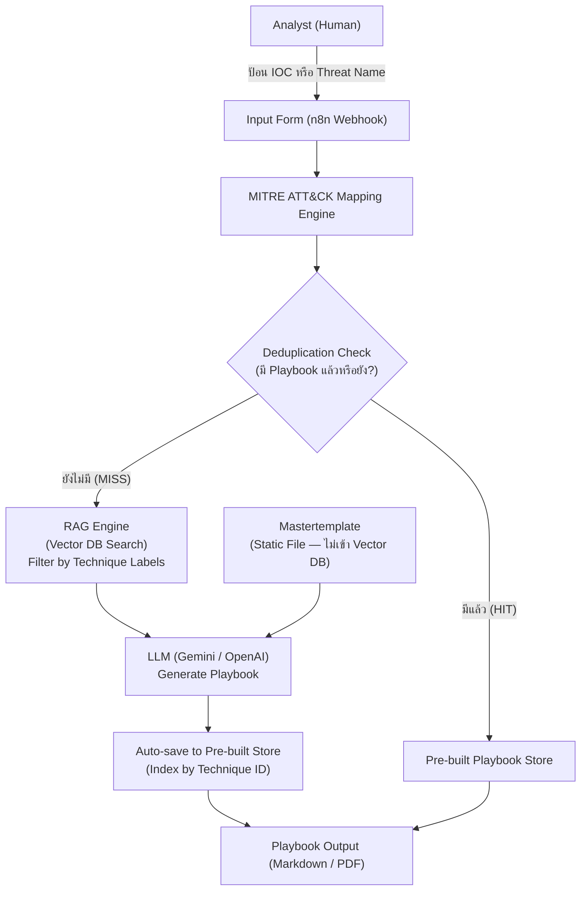
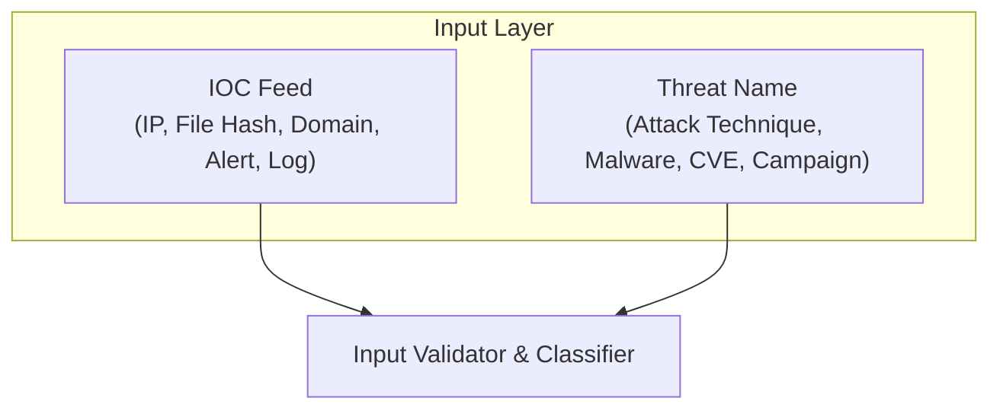
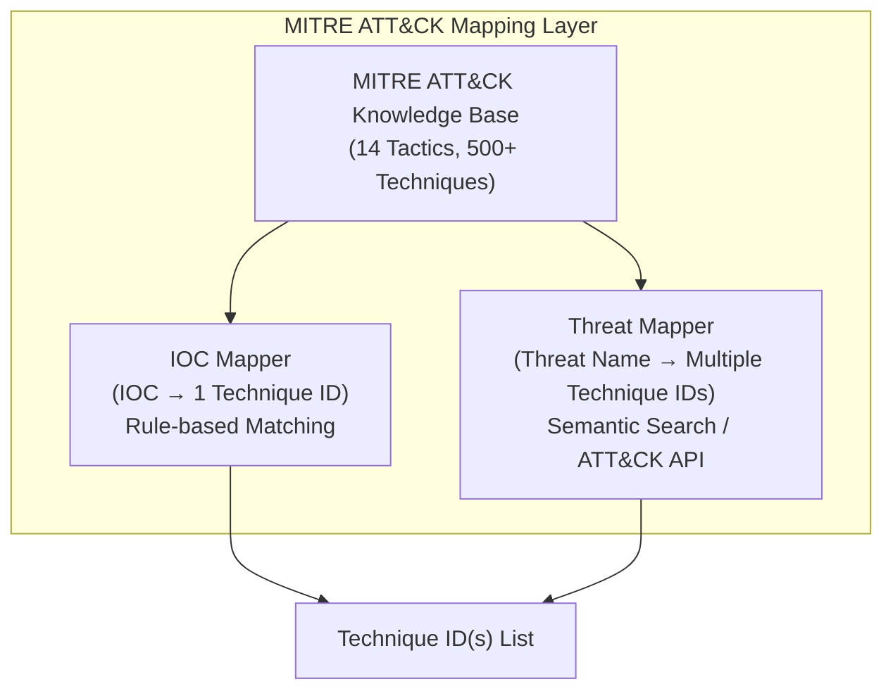
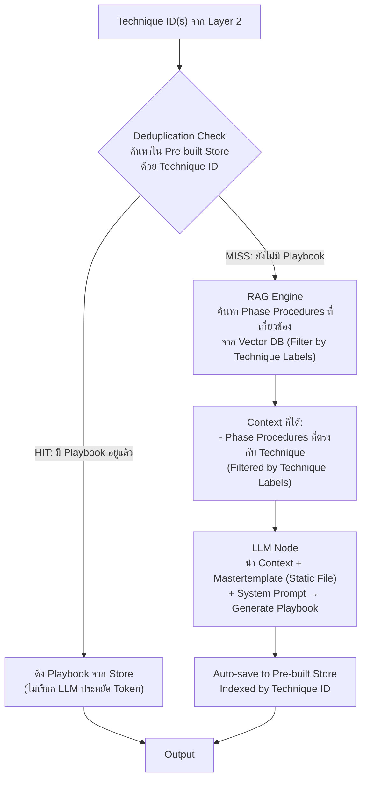
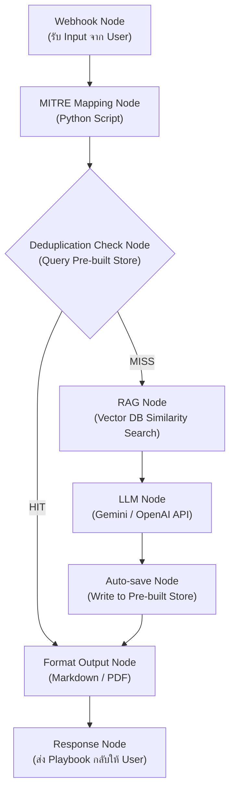
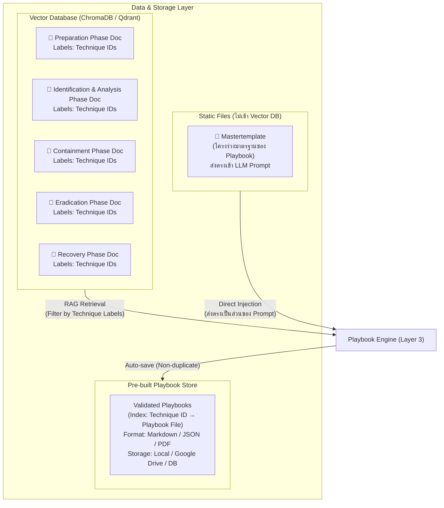
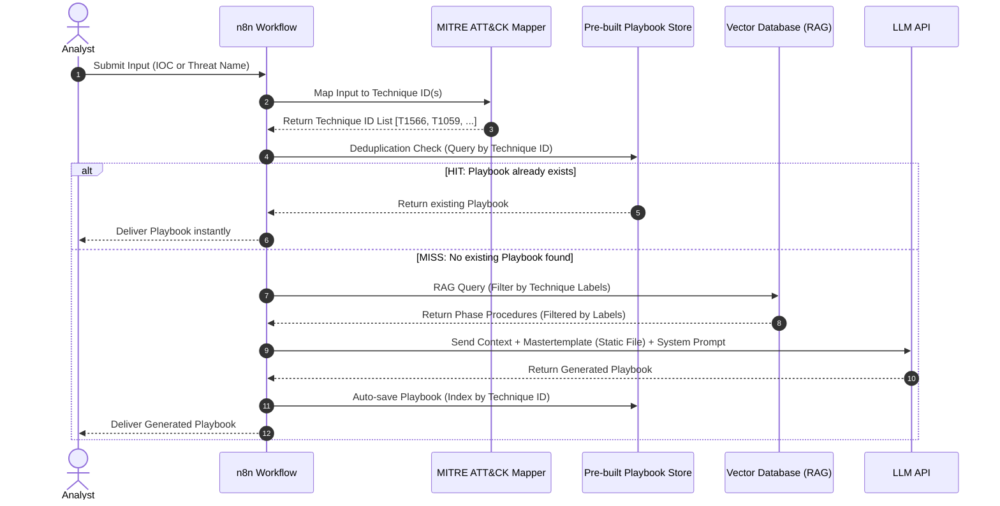
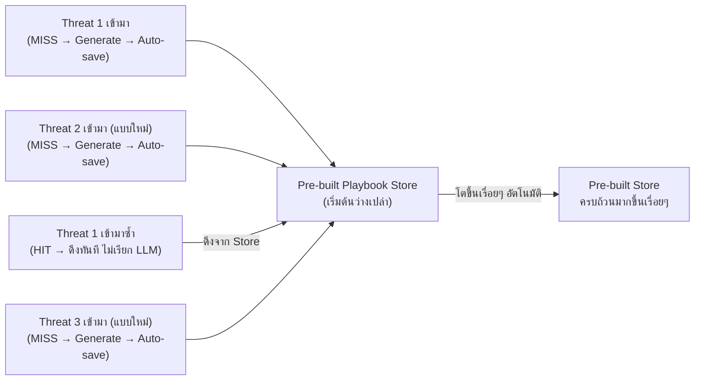

# 🛡️ Omnissiah — Architecture รายละเอียดอย่างละเอียด

> ระบบเวิร์คโฟลว์อัตโนมัติสำหรับสร้าง Incident Response Playbook  
> โดยใช้ **RAG + LLM + Vector Database + n8n Workflow Automation**

> [!IMPORTANT]
> ระบบนี้เป็นแบบ **Fully Automated**
> ผู้ใช้เพียงแค่ป้อน IOC หรือชื่อภัยคุกคาม ระบบจะค้นหา สร้าง และจัดเก็บ Playbook โดยอัตโนมัติ
> โดย Pre-built Playbook Store จะเติบโตขึ้นเรื่อยๆ ทุกครั้งที่มีการโจมตีแบบใหม่เข้ามา

---

## ภาพรวมของระบบ (High-Level Overview)

---

## สถาปัตยกรรมแบบละเอียด (Detailed Architecture)

### Layer 1 — Input Layer (ชั้นรับข้อมูล)

ผู้ใช้ป้อนข้อมูลเพียง **2 ส่วน** (ลดจากเดิม 3 ส่วน เพราะไม่ต้องหา Context เอง):

---

### Layer 2 — Mapping Engine (ชั้นจับคู่ MITRE ATT&CK)

ระบบแปลง Input ให้เป็น **Technique ID** ของ MITRE ATT&CK Framework โดยอัตโนมัติ:

---

### Layer 3 — Decision & Playbook Engine (ชั้นตัดสินใจและสร้าง Playbook)

หัวใจสำคัญของระบบ ทำการตรวจสอบ สร้าง และจัดเก็บ Playbook:

**กฎการ Deduplication:**
- ระบบ Match ด้วย **Technique ID** เป็นหลัก
- หากมี Playbook ที่ใช้ Technique ID เดียวกันอยู่แล้ว → ถือว่าซ้ำ → ส่งอันเก่าออกทันที
- หากไม่ซ้ำ → Generate ใหม่ → บันทึกลง Store

---

### Layer 4 — n8n Workflow Orchestration (ชั้นควบคุม Workflow)

---

### Layer 5 — Data & Storage Layer (ชั้นจัดเก็บข้อมูล)

**กลยุทธ์การจัดเก็บเอกสาร (Document Strategy — 6 Docs Total):**

| เอกสาร | จำนวน | ที่จัดเก็บ | เหตุผล |
|--------|--------|-----------|--------|
| **Mastertemplate** | 1 ไฟล์ | Static File (ส่งตรงใน LLM Prompt) | ป้องกัน Template "ระเบิด" จาก Chunking |
| **Phase Procedure Docs** | 5 ไฟล์ | Vector Database (with Technique Labels) | ค้นหาด้วย Semantic Search + Filter by Technique ID |

> [!IMPORTANT]
> **ทำไม Mastertemplate ต้องไม่เข้า Vector DB?**
> เพราะ Vector DB จะทำ Chunking (ตัดเอกสารเป็นท่อนเล็กๆ) ซึ่งจะทำลายโครงสร้าง Template
> ทำให้ Playbook ที่ Generate ออกมามีโครงสร้างไม่สมบูรณ์ (Template "ระเบิด")
> จึงต้องส่ง Mastertemplate เข้า LLM แบบตรงๆ ผ่าน System Prompt เพื่อรักษาโครงสร้างเอกสาร

**Technique Labels (Metadata) บน Phase Docs:**
- แต่ละ Phase Document จะมี Metadata ระบุ Technique IDs ที่เกี่ยวข้อง
- เมื่อ RAG Engine ค้นหา จะใช้ Technique ID จาก Layer 2 เป็นตัว Filter
- ตัวอย่าง: ถ้าได้ `T1566` (Phishing) → ดึงเฉพาะ Phase Docs ที่ Label ว่ารองรับ `T1566`
- ช่วยลด Noise ได้มาก เพราะไม่ดึง Phase Docs ที่ไม่เกี่ยวข้องกับ Technique นั้นมาใส่ Context

---

## Playbook Document Structure (โครงสร้างเอกสารที่ Generate)

โครงสร้างมาตรฐานของเอกสาร Playbook ที่สร้างขึ้นจาก Mastertemplate:

- **📋 Header Information**
  - Playbook ID (PB-XXXX)
  - Threat Name / Technique ID
  - MITRE ATT&CK Mapping
  - Severity Level (ระดับความรุนแรง)
  - Generated At / Last Updated
- **1️⃣ Preparation Phase**
  - Prerequisites / Required Tools
  - Team Roles & Responsibilities
  - Initial Checklist
- **2️⃣ Identification & Analysis Phase**
  - Detection Indicators / IOC
  - Log Sources to Check
  - Analysis Steps (ทีละขั้น)
  - Severity Assessment Criteria
- **3️⃣ Containment Phase**
  - Short-term Containment (ฉุกเฉิน)
  - Long-term Containment
  - Evidence Preservation Steps
- **4️⃣ Eradication Phase**
  - Root Cause Removal Steps
  - System Hardening Actions
  - Vulnerability Patching
- **5️⃣ Recovery Phase**
  - System Restoration Steps
  - Verification & Testing
  - Return to Normal Operations
- **6️⃣ Post-Incident Review**
  - Lessons Learned
  - Improvement Actions

---

## Tech Stack ที่เลือกใช้

| Component               | Technology                        | หน้าที่                                                |
|-------------------------|-----------------------------------|-------------------------------------------------------|
| **Workflow Engine**     | n8n (Self-hosted)                 | ควบคุม Flow ทั้งหมดแบบอัตโนมัติ                       |
| **LLM**                | Gemini API / OpenAI               | Generate Playbook content                             |
| **Vector Database**     | ChromaDB / Qdrant                 | เก็บ Embeddings ของ Procedures สำหรับ RAG              |
| **Embedding Model**     | text-embedding-004 / nomic-embed  | แปลงเอกสารเป็น Vector สำหรับ Similarity Search       |
| **MITRE ATT&CK Data**  | STIX/TAXII API / Local JSON       | แหล่งข้อมูล Tactics & Techniques                      |
| **Mapping Script**      | Python                            | Rule-based + Semantic Mapping Logic                   |
| **Deduplication Logic** | Python / n8n Function Node        | ตรวจสอบ Technique ID ก่อน Generate                   |
| **Document Format**     | Markdown → PDF                   | รูปแบบ Output ของ Playbook                            |
| **Playbook Store**      | SQLite / JSON Files / Google Drive| เก็บ Pre-built Playbook ที่ Auto-saved แล้ว           |
| **Frontend**            | Simple HTML Form / n8n Form Node  | UI สำหรับ Analyst ป้อน Input                         |

---

## Data Flow แบบ Step-by-Step (Fully Automated)

---

## กระบวนการ Self-Growing Store (การเติบโตของ Pre-built Store)

---

## ขอบเขตที่อยู่ในระบบ / นอกระบบ

| ขอบเขต                                                          | ✅ ในระบบ | ❌ นอกระบบ |
|-----------------------------------------------------------------|----------|----------|
| รับ Input แบบ Text (IOC / Threat Name)                          | ✅       |          |
| Map กับ MITRE ATT&CK อัตโนมัติ                                  | ✅       |          |
| RAG ดึง Context จาก Vector DB อัตโนมัติ                         | ✅       |          |
| Deduplication Check ก่อน Generate                              | ✅       |          |
| Generate Playbook ด้วย LLM อัตโนมัติ                           | ✅       |          |
| Auto-save Playbook ที่ไม่ซ้ำลง Pre-built Store                  | ✅       |          |
| Pre-built Store โตขึ้นเองทุกครั้งที่พบ Threat ใหม่              | ✅       |          |
| Output เป็น Markdown / PDF                                      | ✅       |          |
| เชื่อมต่อกับ SIEM โดยตรง (Real-time Alert Feed)                |          | ❌       |
| Execute / Automate การแก้ไขระบบ (Remediation)                  |          | ❌       |
| Human Validation ก่อน Auto-save (ถ้าต้องการ Quality Control)   |          | ❌ (Optional) |

---

*จัดทำโดย: Omnissiah Project Team*  
*อัปเดตล่าสุด: มิถุนายน 2569*
