# 🛡️ Omnissiah — Architecture รายละเอียดอย่างละเอียด

> ระบบเวิร์คโฟลว์อัตโนมัติสำหรับสร้าง Incident Response Playbook  
> โดยใช้ **RAG + LLM + Vector Database + n8n Workflow Automation**

> [!IMPORTANT]
> ระบบนี้เป็นแบบ **Fully Automated**
> ผู้ใช้เพียงแค่ป้อน IOC หรือชื่อภัยคุกคาม ระบบจะค้นหา สร้าง และจัดเก็บ Playbook โดยอัตโนมัติ
> โดย Pre-built Playbook Store จะเติบโตขึ้นเรื่อยๆ ทุกครั้งที่มีการโจมตีแบบใหม่เข้ามา

---

## ภาพรวมของระบบ (High-Level Overview)

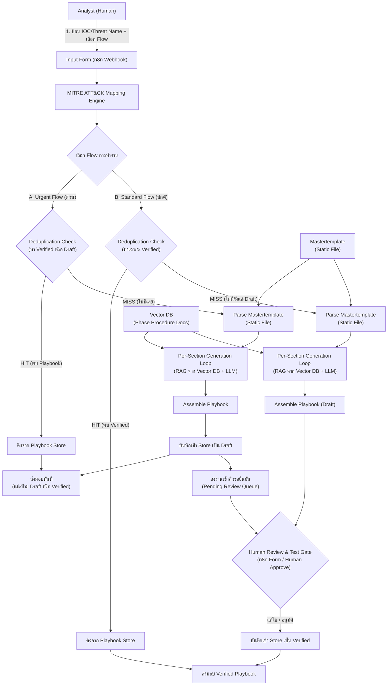

---

## สถาปัตยกรรมแบบละเอียด (Detailed Architecture)

### Layer 1 — Input Layer (ชั้นรับข้อมูล)

ผู้ใช้ป้อนข้อมูลเพียง **2 ส่วน**:

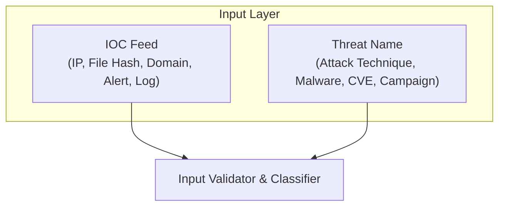

> [!WARNING]
> **ข้อควรระวังเรื่อง IOC Input:**
> อาการดิบๆ เช่น "CPU สูง" มัน ambiguous มาก อาจเป็น cryptomining (T1496), process injection (T1055)
> หรือ process ปกติก็ได้ — เป็นความสัมพันธ์ **many-to-many** ไม่ใช่ 1:1
> ทางที่ดี IOC ที่เข้าระบบควรเป็น detection ที่ผ่าน triage / มี ATT&CK tag มาแล้ว (จาก EDR/SIEM)
> ไม่ใช่ symptom ดิบที่ให้ระบบเดาเอง

---

### Layer 2 — Mapping Engine (ชั้นจับคู่ MITRE ATT&CK)

ระบบแปลง Input ให้เป็น **Technique ID** ของ MITRE ATT&CK Framework โดยอัตโนมัติ:

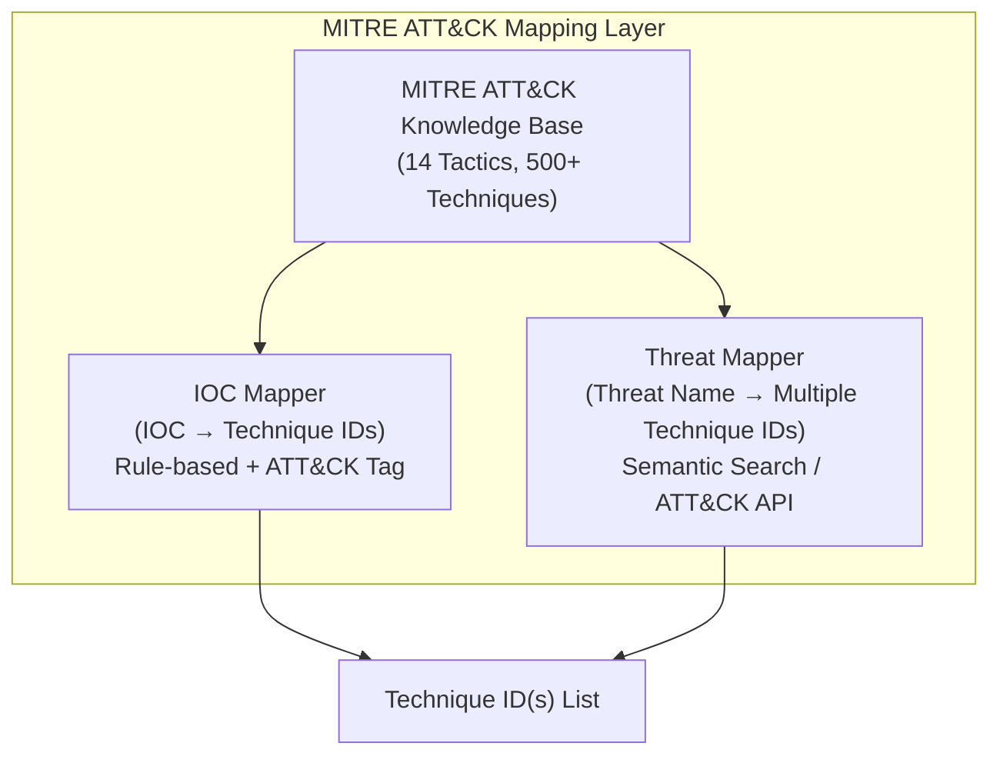

> [!NOTE]
> **ทั้งสองฝั่ง Map ได้หลาย Technique เหมือนกัน**
> IOC เดียวกันอาจเกี่ยวข้องกับหลาย Technique ได้ เช่น Phishing email อาจ map ได้ทั้ง T1566 และ T1204
> Threat เดียวกันยิ่ง map ได้หลาย Technique เช่น React2Shell → T1190, T1059, T1078, T1053, T1547
> Mapping ต้อง ground ด้วยแหล่งข้อมูลจริง (ATT&CK, CTI Feed) **ไม่ใช่ให้ LLM เดา**

---

### Layer 3 — Decision & Playbook Engine (ชั้นตัดสินใจและสร้าง Playbook)

หัวใจสำคัญของระบบ — ควบคุมลำดับการค้นหา การตรวจสอบความซ้ำซ้อนด้วยสถานะ และการใช้ **Per-Section Generation Loop**:

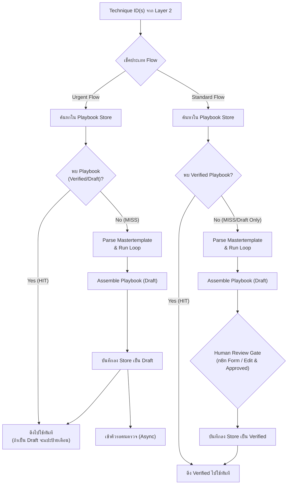

**กฎการตัดสินใจของ Deduplication Engine:**

- **Urgent Flow (เน้นความเร็วสูงสุด):**
  1. ค้นหา `Verified Playbook` ด้วย Technique ID ใน Store -> หากเจอให้ส่งมอบทันที
  2. หากไม่เจอ `Verified` แต่เจอ `Draft Playbook` -> ดึง `Draft` มาส่งมอบทันที โดยเพิ่มแบนเนอร์แจ้งเตือนเด่นชัด: `⚠️ [DRAFT - UNVERIFIED PLAYBOOK]` เพื่อแจ้งผู้ใช้ยอมรับความเสี่ยง
  3. หากไม่พบเลย -> สร้างใหม่เป็น `Draft` -> ส่งมอบ -> บันทึกเข้าระบบเป็น `Draft` -> ส่งงานเข้าคิวรอยืนยัน (Queue) เพื่อตรวจภายหลัง
- **Standard Flow (เน้นความปลอดภัยและถูกต้อง):**
  1. ค้นหา `Verified Playbook` ด้วย Technique ID ใน Store -> หากเจอให้ส่งมอบทันที
  2. หากไม่พบ หรือพบแค่ `Draft` -> เข้าสู่ขั้นตอน Generate ใหม่ -> ส่งมอบให้คนตรวจสอบแก้ไขผ่าน Portal (n8n Form) -> บันทึกผลลัพธ์เป็น `Verified` เสมอ

---

### Layer 3.5 — Mastertemplate Slot Architecture (โครงสร้าง Slot ของ Template)

Mastertemplate ไม่ใช่เอกสารให้คนอ่าน — มันคือ **spec ที่เครื่อง generator จะ parse**
แต่ละ section ประกอบด้วย 3 ส่วน:

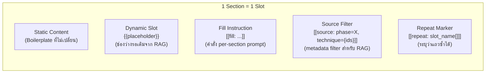

**Convention ที่ใช้ใน Mastertemplate:**

| Marker | ความหมาย | ตัวอย่าง |
|--------|----------|----------|
| `{{placeholder}}` | ช่องว่าง dynamic ที่ generator จะเติม | `{{threat_name}}`, `{{containment_steps}}` |
| `[[fill: ...]]` | คำสั่ง prompt สำหรับ generate section นั้น | `[[fill: เขียน containment steps เป็น numbered list]]` |
| `[[source: ...]]` | metadata filter สำหรับ RAG retrieval | `[[source: phase=containment, technique={technique_ids}]]` |
| `[[repeat: ...]]` | ระบุว่า slot นี้ทำซ้ำได้หลายแถว | `[[repeat: mitre_techniques[]]]` |

**Slot Schema ทั้งหมดที่ Generator ต้อง Parse:**

```
Header:
  threat_name              : text
  detection_sla            : text
  mitre_techniques[]       : repeating (technique_id, tactic, technique_name)

Phase 1 — Preparation:
  prep_tools[]             : repeating rows (prep_tool, prep_check_command)
  [[fill: ใส่ tool ที่ต้องใช้ + คำสั่งเช็คความพร้อม]]
  [[source: phase=preparation, technique={technique_ids}]]

Phase 2 — Detection & Analysis:
  detection[]              : repeating rows (detection_item, detection_command)
  [[fill: list สิ่งที่ต้องตรวจ + คำสั่ง/query ต่อแถว]]
  [[source: phase=detection, technique={technique_ids}]]

Phase 3 — Containment:
  containment[]            : repeating rows (containment_target, containment_steps)
  [[fill: เขียน containment steps ที่ตรงกับ technique เป็น numbered list]]
  [[source: phase=containment, technique={technique_ids}]]

Phase 4 — Eradication & Recovery:
  eradication[]            : repeating rows (eradication_action, eradication_steps)
  [[fill: เขียนขั้นตอนกำจัด root cause + กู้คืนระบบ]]
  [[source: phase=eradication, technique={technique_ids}]]

Phase 5 — Post-Incident:
  post_incident_summary    : text
  [[fill: สรุป lessons learned + improvement actions]]
```

> [!CAUTION]
> **กฎเหล็กของ Mastertemplate:**
> - Template ต้องเป็น **threat-agnostic** — ห้ามมีชื่อ threat ใดๆ hardcode อยู่ในเนื้อหา
> - ใช้ `{{threat_name}}` แทน ไม่ใช่เขียนว่า "Phishing" ตรงๆ
> - ห้ามเอาเนื้อหา procedure จริงมายัดใน template — template มีแค่โครง + placeholder + instruction
> - ชื่อ placeholder ต้องเป็น **snake_case ตัวเล็กล้วน** ไม่มีเว้นวรรค

---

### Layer 4 — n8n Workflow Orchestration (ชั้นควบคุม Workflow)

n8n จะเป็นตัวแยกการทำงาน (Switch Node) และเก็บสถานะงานรอรีวิวด้วย Waiting Node:

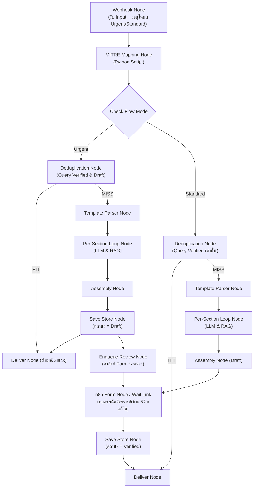

---

### Layer 5 — Data & Storage Layer (ชั้นจัดเก็บข้อมูล)

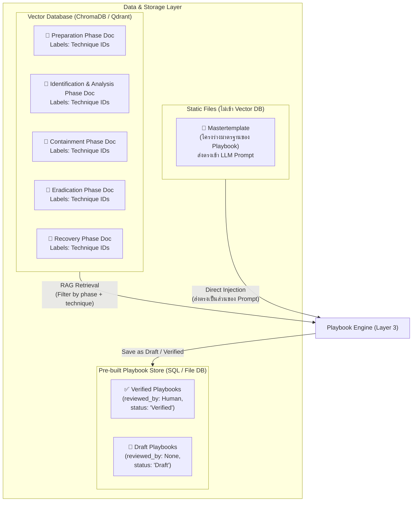

**กลยุทธ์การจัดเก็บเอกสาร (Document Strategy — 6 Docs Total):**

| เอกสาร | จำนวน | ที่จัดเก็บ | เหตุผล |
|--------|--------|-----------|--------|
| **Mastertemplate** | 1 ไฟล์ | Static File (ส่งตรงใน LLM Prompt) | ป้องกัน Template "ระเบิด" จาก Chunking |
| **Phase Procedure Docs** | 5 ไฟล์ | Vector Database (with Technique Labels) | ค้นหาด้วย Semantic Search + Filter by Technique ID |

> [!IMPORTANT]
> **ทำไม Mastertemplate ต้องไม่เข้า Vector DB?**
> เพราะ Vector DB จะทำ Chunking (ตัดเอกสารเป็นท่อนเล็กๆ) ซึ่งจะทำลายโครงสร้าง Template
> ทำให้ Playbook ที่ Generate ออกมามีโครงสร้างไม่สมบูรณ์ (Template "ระเบิด")
> จึงต้องส่ง Mastertemplate เข้า LLM แบบตรงๆ ผ่าน System Prompt เพื่อรักษาโครงสร้างเอกสาร

**การเก็บสถานะใน Pre-built Playbook Store:**
- Playbook ทุกไฟล์ที่ถูกเก็บจะมี Metadata ประกอบด้วย:
  - `playbook_id`: รหัสเอกสาร (เช่น PB-1002)
  - `technique_id`: MITRE Technique ID
  - `status`: `Draft` หรือ `Verified` หรือ `Deprecated`
  - `created_at`: วันที่สร้าง
  - `verified_at`: วันที่ผ่านการตรวจสอบโดยคน (เว้นว่างหากสถานะเป็น Draft)
  - `verified_by`: ชื่อของนักวิเคราะห์ผู้รีวิว

**Chunking Strategy สำหรับ Phase Procedure Docs:**

| หัวข้อ | รายละเอียด |
|--------|-----------|
| **วิธี Chunk** | ตัดตาม heading/section ของเอกสาร (ไม่ใช่ fixed token) เก็บ list ขั้นตอนให้อยู่ก้อนเดียวกัน |
| **Metadata ต่อ Chunk** | `phase` (prep/detect/contain/erad/recovery), `technique_id`, `source_doc`, `heading` |
| **การ Filter** | ใช้ **metadata filter** (phase + technique) ร่วมกับ vector similarity — ไม่ใช่ similarity อย่างเดียว |
| **ทำไมต้อง Filter** | กันไม่ให้ chunk ของ Containment โผล่ตอนกำลังเขียน Preparation แค่เพราะใกล้กันเชิงความหมาย |

**Technique Labels (Metadata) บน Phase Docs:**
- แต่ละ Phase Document จะมี Metadata ระบุ Technique IDs ที่เกี่ยวข้อง
- เมื่อ RAG Engine ค้นหา จะใช้ Technique ID จาก Layer 2 เป็นตัว Filter
- ช่วยลด Noise ได้มาก เพราะไม่ดึง Phase Docs ที่ไม่เกี่ยวข้องกับ Technique นั้นมาใส่ Context

---

## 🔄 Playbook Development Lifecycle (PDLC)

เพื่อแก้ไขปัญหา "สร้างเสร็จแล้วปล่อยลืม" (Generate & Forget) และรักษาความน่าเชื่อถือของเนื้อหาที่เป็นขั้นตอนปฏิบัติจริง ระบบจึงนำหลักการวงจรชีวิตของ Playbook มาบังคับใช้ โดยมีกระบวนการและสถานะการเปลี่ยนผ่านดังนี้:

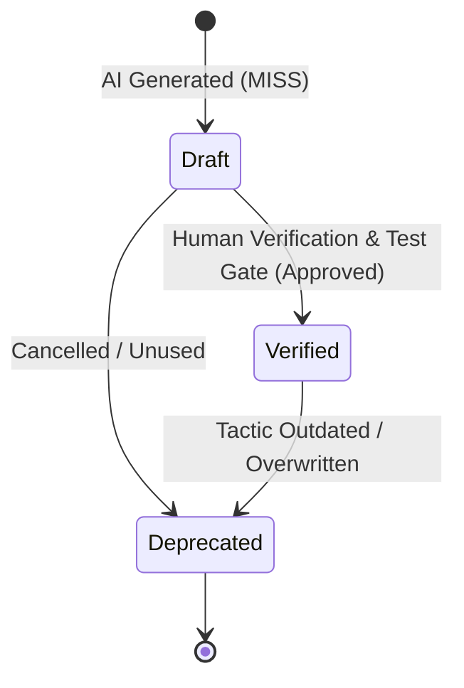

### 1. สถานะเอกสาร (Playbook States)
- **Draft (ฉบับร่าง):** Playbook ที่พึ่งถูกสร้างขึ้นจาก AI ยังไม่ผ่านการตรวจสอบ/ทดสอบจริงโดยคน มีความเสี่ยงที่เนื้อหาบางอย่างอาจไม่ตรงกับระบบภายในขององค์กร หรืออาจมีหลอน (Hallucination) เล็กน้อย
- **Verified (ฉบับผ่านการตรวจสอบ):** Playbook ที่ได้รับการทดสอบและรับรองความถูกต้องโดยมนุษย์ (Security Analyst) เรียบร้อยแล้ว ถือว่าเป็นเอกสารที่น่าเชื่อถือ ใช้งานในระบบผลิตจริงได้อย่างปลอดภัย
- **Deprecated (ฉบับยกเลิกใช้งาน):** Playbook ที่หมดอายุหรือถูกแทนที่ด้วยวิธีรับมือที่ดีกว่า เพื่อไม่ให้คนหยิบไปใช้ซ้ำ

### 2. วงจรการพัฒนาระหว่าง 2 Flows
- **Urgent Flow (Fast Path):**
  - เน้นบริการผู้ใช้ทันทีเมื่อมีเคสระดับวิกฤตเกิดขึ้น
  - ผลลัพธ์ที่ส่งมอบให้ผู้ใช้จะถูกทำเครื่องหมายตัวใหญ่ชัดเจนว่าเป็น **Draft (Unverified)**
  - ในเบื้องหลัง ระบบจะส่งคำขอตรวจสอบเข้าคิว **Pending Review Queue** โดยอัตโนมัติเพื่อให้คนมารีวิวภายหลัง
- **Standard Flow (Verified Path):**
  - เป็นวงจรมาตรฐานในการสร้าง Playbook ต้นแบบเก็บสะสมไว้ใน Store
  - AI จะรัน RAG และ LLM เป็นด่านแรกเพื่อสร้างโครงร่าง
  - จากนั้นจะหยุดรอ (Wait) ที่ **Human Verification Gate** (ส่ง Form ไปให้นักวิเคราะห์แก้ไขและรีวิวผ่านเว็บฟอร์ม)
  - หลังจากคนคลิกตรวจสอบและกดยืนยัน (Approve) เท่านั้น เอกสารจึงจะได้รับการบันทึกเป็นสถานะ `Verified`

---

## Per-Section Generation Loop (กลไกการ Generate ทีละ Section)

นี่คือหัวใจของระบบ — ทำงานเป็น loop วนทีละ slot ตามโครงของ Mastertemplate:

```mermaid
sequenceDiagram
    autonumber
    participant Template as Mastertemplate Parser
    participant Loop as Generation Loop
    participant VDB as Vector DB
    participant LLM as LLM API

    Template->>Loop: แตก Template เป็น N Sections (Slots)

    loop สำหรับแต่ละ Section (Phase)
        Loop->>Loop: 1. สร้าง Query เฉพาะ Section<br/>(ใช้ [[fill]] + Technique ID)
        Loop->>VDB: 2. RAG Retrieve<br/>(Filter: phase=section_name, technique=ids)
        VDB-->>Loop: Return Chunks ที่ตรง Phase + Technique
        Loop->>LLM: 3. Generate Section<br/>(Slot Instruction + Retrieved Chunks + Context)
        LLM-->>Loop: Return Generated Section Content
        Loop->>Loop: 4. เก็บผลลัพธ์ของ Section นี้
    end

    Loop->>Template: 5. ประกอบทุก Section กลับเข้า Template Structure
    Template-->>Loop: Playbook สมบูรณ์
```

**ตัวอย่าง 1 รอบของ Loop (Section: Containment):**

```
Query = "containment steps for T1190 / React2Shell"
      ↓
RAG Filter = { phase: "containment", technique_id: "T1190" }
      ↓
Retrieved Chunks:
  - "Isolate affected server from network immediately..."
  - "Block exploit traffic at WAF/reverse proxy..."
      ↓
LLM Prompt = [[fill]] instruction + Retrieved Chunks + Incident Context
      ↓
Generated Output = Containment section ที่เฉพาะกับ T1190
```

---

## Playbook Document Structure (โครงสร้างเอกสารที่ Generate)

โครงสร้างมาตรฐานของเอกสาร Playbook ที่สร้างขึ้นจาก Mastertemplate:

- **📋 Header Information**
  - Playbook ID (PB-XXXX)
  - `{{threat_name}}` / Technique ID(s)
  - MITRE ATT&CK Mapping `[[repeat: mitre_techniques[]]]`
  - Severity Level (ระดับความรุนแรง)
  - Generated At / Last Updated
- **1️⃣ Preparation Phase** `[[source: phase=preparation]]`
  - Prerequisites / Required Tools `[[repeat: prep_tools[]]]`
  - Team Roles & Responsibilities
  - Initial Checklist
- **2️⃣ Identification & Analysis Phase** `[[source: phase=detection]]`
  - Detection Indicators / IOC `[[repeat: detection[]]]`
  - Log Sources to Check
  - Analysis Steps (ทีละขั้น)
  - Severity Assessment Criteria
- **3️⃣ Containment Phase** `[[source: phase=containment]]`
  - Short-term Containment (ฉุกเฉิน) `[[repeat: containment[]]]`
  - Long-term Containment
  - Evidence Preservation Steps
- **4️⃣ Eradication & Recovery Phase** `[[source: phase=eradication]]`
  - Root Cause Removal Steps `[[repeat: eradication[]]]`
  - System Hardening Actions
  - Vulnerability Patching
  - System Restoration & Verification
- **5️⃣ Post-Incident Review**
  - Lessons Learned `{{post_incident_summary}}`
  - Improvement Actions

---

## Tech Stack ที่เลือกใช้

| Component               | Technology                        | หน้าที่                                                |
|-------------------------|-----------------------------------|-------------------------------------------------------|
| **Workflow Engine**     | n8n (Self-hosted)                 | ควบคุม Flow ทั้งหมด + Per-Section Loop               |
| **LLM**                | Gemini API / OpenAI               | Generate Playbook content ทีละ Section                |
| **Vector Database**     | ChromaDB / Qdrant                 | เก็บ Embeddings ของ Procedures + Metadata Filter      |
| **Embedding Model**     | text-embedding-004 / nomic-embed  | แปลงเอกสารเป็น Vector สำหรับ Similarity Search       |
| **MITRE ATT&CK Data**  | STIX/TAXII API / Local JSON       | แหล่งข้อมูล Tactics & Techniques                      |
| **Mapping Script**      | Python                            | Rule-based + Semantic Mapping Logic                   |
| **Deduplication Logic** | Python / n8n Function Node        | ตรวจสอบ Technique ID ก่อน Generate                   |
| **Template Parser**     | Python / n8n Function Node        | Parse Mastertemplate เป็น Slots + ประกอบกลับ           |
| **Document Format**     | Markdown → PDF                   | รูปแบบ Output ของ Playbook                            |
| **Playbook Store**      | SQLite / JSON Files / Google Drive| เก็บ Pre-built Playbook ที่ Auto-saved แล้ว           |
| **Frontend**            | Simple HTML Form / n8n Form Node  | UI สำหรับ Analyst ป้อน Input                         |

---

## Data Flow แบบ Step-by-Step (Urgent vs Standard Mode)

### A. Urgent Flow (Fast Path)

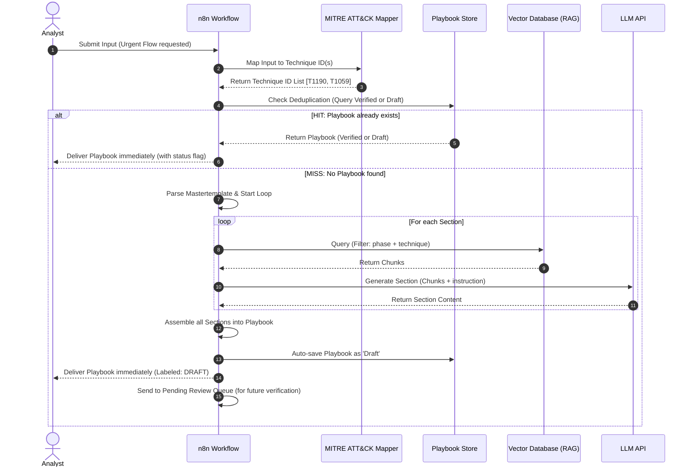

### B. Standard Flow (Human-Verified Path)

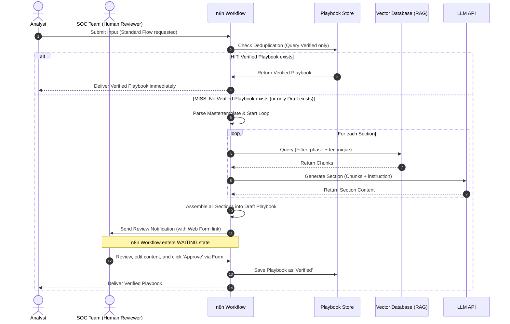

---

## กระบวนการ Self-Growing Store (การเติบโตของ Playbook Store)

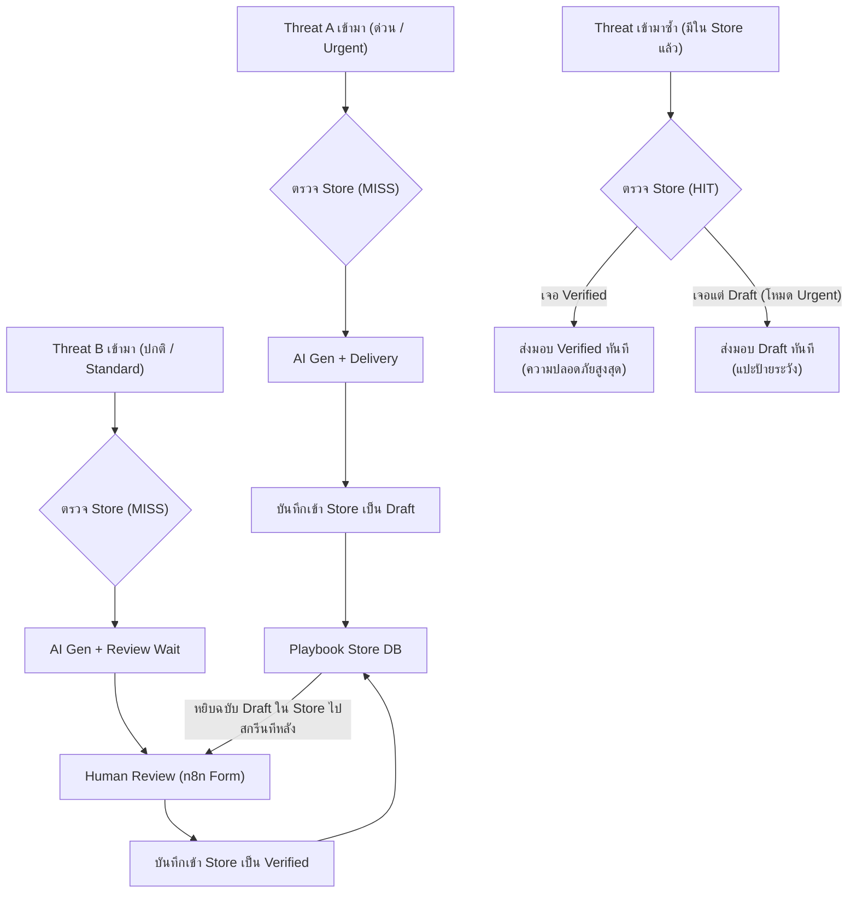

> [!TIP]
> **คุม Reproducibility และคุณภาพด้วย:**
> - ตั้ง LLM temperature ต่ำ (0.1–0.3) เพื่อความเสถียรของเนื้อหา
> - ใช้ Mastertemplate กำหนดกรอบของผลลัพธ์ไม่ให้หลุดขอบเขต
> - การนำระบบตรวจสอบคุณภาพโดยคนมาประยุกต์ใช้ (Human Review) จะทำให้ความถูกต้องของคลังความรู้สูงขึ้นอย่างเป็นระบบ

---

## ข้อควรระวังเชิงสถาปัตยกรรม (Architecture Considerations)

> [!WARNING]
> **Playbook ที่ Generate ออกมาอาจ "Generic" เกินไป**
> ถ้าเอกสาร Phase เป็นเนื้อหากลางๆ (preparation ทั่วไป) playbook ที่ได้ก็จะกลางๆ ตาม
> ของที่ทำให้ playbook มีค่าจริงคือ **detection + mitigation ที่เฉพาะกับ technique**
> ซึ่ง ATT&CK แต่ละ technique มี Detection + Mitigation ให้อยู่แล้ว ลองดึงมายัดตอน generate ด้วย

> [!WARNING]
> **Threat ใหม่ที่ยังไม่มีใคร Map**
> ATT&CK/CTI ของ CVE สดๆ อาจยังไม่มี mapping เป็นอาทิตย์
> ถ้าฝั่ง generate ไปพึ่ง LLM ล้วนๆ มันจะมั่ว
> Generate flow จะเชื่อถือได้เฉพาะ threat ที่ documented ดีแล้ว

---

## ขอบเขตที่อยู่ในระบบ / นอกระบบ

| ขอบเขต                                                          | ✅ ในระบบ | ❌ นอกระบบ |
|-----------------------------------------------------------------|----------|----------|
| รับ Input แบบ Text (IOC / Threat Name)                          | ✅       |          |
| Map กับ MITRE ATT&CK อัตโนมัติ                                  | ✅       |          |
| RAG ดึง Context จาก Vector DB อัตโนมัติ (Filter by metadata)    | ✅       |          |
| Deduplication Check ก่อน Generate                              | ✅       |          |
| Per-Section Generation Loop (วน generate ทีละ section)         | ✅       |          |
| Auto-save Playbook ที่ไม่ซ้ำลง Pre-built Store                  | ✅       |          |
| Pre-built Store โตขึ้นเองทุกครั้งที่พบ Threat ใหม่              | ✅       |          |
| Output เป็น Markdown / PDF                                      | ✅       |          |
| เชื่อมต่อกับ SIEM โดยตรง (Real-time Alert Feed)                |          | ❌       |
| Execute / Automate การแก้ไขระบบ (Remediation)                  |          | ❌       |
| Human Validation ก่อน Auto-save (ถ้าต้องการ Quality Control)   |          | ❌ (Optional) |

---

## Development Roadmap (ลำดับการพัฒนา)

| Step | งาน | เสร็จเมื่อ | หมายเหตุ |
|------|------|-----------|----------|
| **1** | ล็อค Mastertemplate + แตกเป็น Slot Structure | มี template ที่ threat-agnostic พร้อม slot markers | ✅ เสร็จแล้ว |
| **2** | เตรียม Test Case + เกณฑ์วัด | มี gold-standard playbook ไว้เทียบ | ใช้ React2Shell เป็นเคสแรก |
| **3** | Manual Fill Run (ไม่ใช้ Vector DB) | รู้ว่า prompt/template เวิร์คหรือต้องแก้ | ตอบคำถามแพงที่สุดของโปรเจกต์ |
| **4** | สร้าง Retrieval Layer | retrieve ตรงกับที่คัดมือ | chunk + metadata + embed + filter eval |
| **5** | ประกอบ Generation Loop เต็ม | ใส่ threat name แล้ว generate ได้ครบทั้งเล่ม | per-section loop + assembly |
| **6** | Mapping Layer | ใส่ชื่อ threat แล้วได้ technique list | เริ่มจาก manual table ก่อน |
| **7** | Human Review Gate + Save เข้า Library | มี playbook ผ่าน review ตัวแรกเข้า library | library เริ่มมีของให้ retrieve |
| **8** | Scale | เพิ่ม threat / template / mapping | ค่อยขยายทีหลัง |

> [!TIP]
> **วินัยที่ต้องถือตลอดทาง:**
> - ทำ **1 template / 1 threat / manual ก่อน** เสมอ
> - ทำ **generate flow ก่อน retrieve flow** (เพราะ library ยังว่าง จะ retrieve อะไรไม่ได้)
> - Mapping ต้อง **ground ด้วย table** ก่อนค่อยพึ่ง LLM
> - คุม reproducibility ด้วย **temperature ต่ำ + cache ผลที่ผ่าน review**

---

*จัดทำโดย: Omnissiah Project Team*  
*อัปเดตล่าสุด: มิถุนายน 2569*
