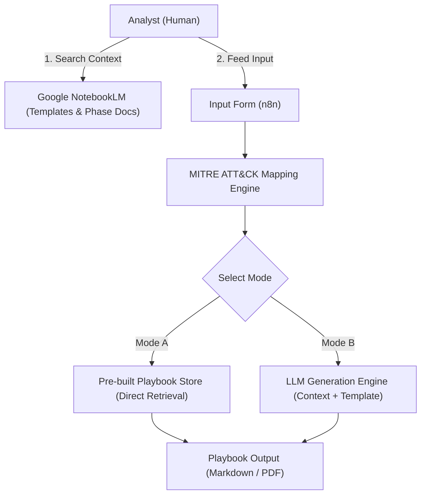
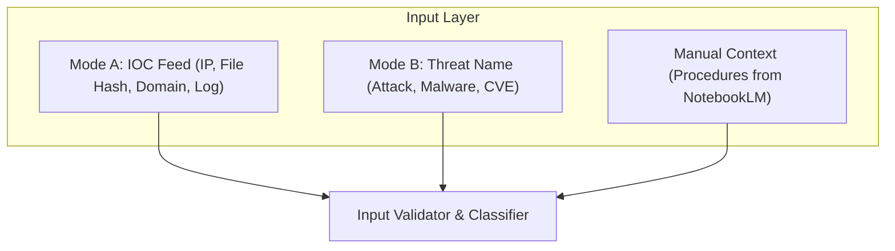
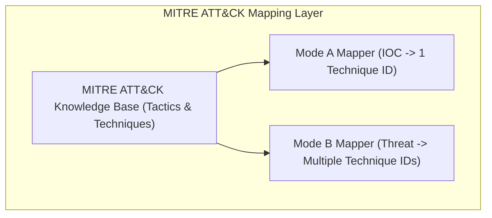
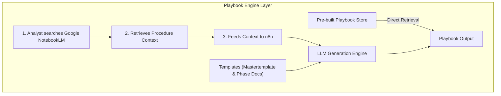
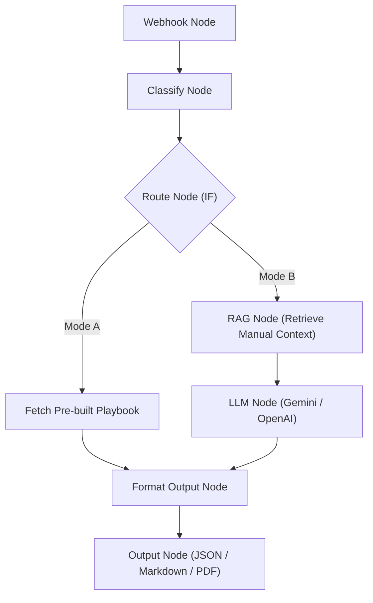
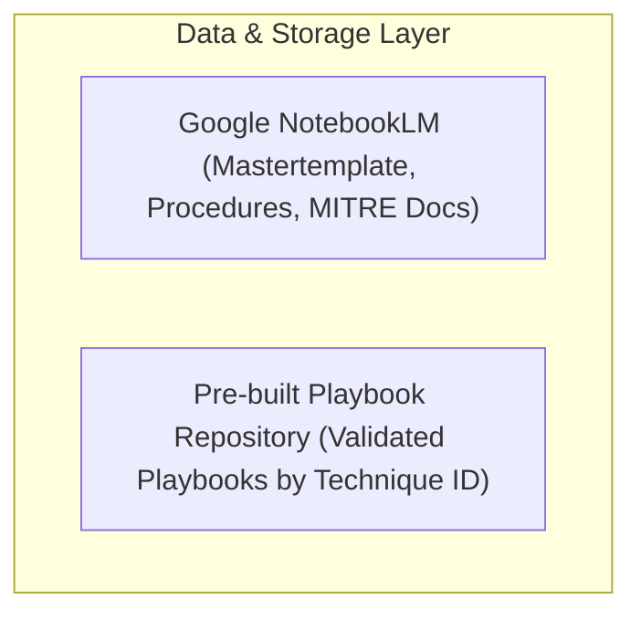
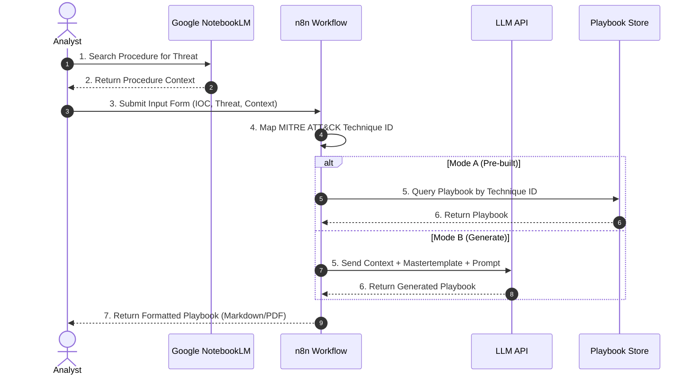

# 🛡️ Omnissiah — Architecture รายละเอียดอย่างละเอียด

> ระบบเวิร์คโฟลว์กึ่งอัตโนมัติสำหรับสร้าง Incident Response Playbook  
> โดยใช้ LLM + Google NotebookLM (Knowledge Base) + n8n Workflow Automation

> [!IMPORTANT]
> ระบบนี้เป็นแบบ **Semi-Automated (Human-in-the-Loop)**  
> Analyst จะเป็นผู้ค้นหา Context จาก **Google NotebookLM** แล้วป้อนเข้าสู่ n8n เอง  
> เนื่องจาก NotebookLM ไม่มี Public API สำหรับเรียกใช้อัตโนมัติ

---

## ภาพรวมของระบบ (High-Level Overview)

---

## สถาปัตยกรรมแบบละเอียด (Detailed Architecture)

### Layer 1 — Input Layer (ชั้นรับข้อมูล)

---

### Layer 2 — Mapping Engine (ชั้นจับคู่ MITRE ATT&CK)

---

### Layer 3 — Playbook Retrieval & Generation Engine

---

### Layer 4 — n8n Workflow Orchestration (ชั้นควบคุม Workflow)

---

### Layer 5 — Data & Storage Layer (ชั้นจัดเก็บข้อมูล)

---

## Playbook Document Structure (โครงสร้างเอกสารที่ Generate)

โครงสร้างมาตรฐานของเอกสาร Playbook ที่สร้างขึ้นจาก Mastertemplate ประกอบด้วยหัวข้อดังนี้:

- **📋 Header Information**
  - Playbook ID (PB-XXXX)
  - Threat Name / Technique ID
  - MITRE ATT&CK Mapping
  - Severity Level (ระดับความรุนแรง)
  - Last Updated (วันที่อัปเดตล่าสุด)
- **1️⃣ Preparation Phase**
  - Prerequisites / Required Tools (เครื่องมือและข้อกำหนดเบื้องต้น)
  - Team Roles & Responsibilities (บทบาทหน้าที่ของทีมงาน)
  - Initial Checklist (รายการตรวจสอบเบื้องต้น)
- **2️⃣ Identification & Analysis Phase**
  - Detection Indicators / IOC (สิ่งบ่งชี้ภัยคุกคาม)
  - Log Sources to Check (แหล่งข้อมูล Log ที่ต้องตรวจสอบ)
  - Analysis Steps (ขั้นตอนการวิเคราะห์)
  - Severity Assessment Criteria (เกณฑ์การประเมินความรุนแรง)
- **3️⃣ Containment Phase**
  - Short-term Containment (การควบคุมความเสียหายระยะสั้น/ฉุกเฉิน)
  - Long-term Containment (การควบคุมความเสียหายระยะยาว)
  - Evidence Preservation Steps (ขั้นตอนการเก็บรักษาหลักฐาน)
- **4️⃣ Eradication Phase**
  - Root Cause Removal Steps (ขั้นตอนการกำจัดต้นตอของปัญหา)
  - System Hardening Actions (การปรับปรุงความปลอดภัยของระบบ)
  - Vulnerability Patching (การแก้ไขช่องโหว่)
- **5️⃣ Recovery Phase**
  - System Restoration Steps (ขั้นตอนการกู้คืนระบบกลับมาใช้งาน)
  - Verification & Testing (การตรวจสอบและทดสอบความพร้อม)
  - Return to Normal Operations (การกลับเข้าสู่การดำเนินงานปกติ)
- **6️⃣ Post-Incident Review**
  - Lessons Learned (บทเรียนที่ได้รับ)
  - Improvement Actions (ข้อแนะนำเพื่อปรับปรุงระบบ)

---

## Tech Stack ที่เลือกใช้

| Component               | Technology                        | หน้าที่                                          |
|-------------------------|-----------------------------------|--------------------------------------------------|
| **Workflow Engine**     | n8n (Self-hosted)                 | ควบคุม Flow ทั้งหมด                              |
| **LLM**                | Gemini API / OpenAI               | Generate Playbook content                        |
| **Knowledge Base**      | Google NotebookLM ☁️              | เก็บและค้นหา Procedure/Template Docs            |
| **MITRE ATT&CK Data**  | STIX/TAXII API / Local JSON       | แหล่งข้อมูล Techniques                           |
| **Backend Script**      | Python                            | Mapping Logic, API Calls                         |
| **Document Format**     | Markdown → PDF                   | รูปแบบ Output ของ Playbook                       |
| **Frontend (Optional)** | Simple HTML Form / n8n Form Node | UI สำหรับ Analyst ป้อน Input + Context          |
| **Playbook Store**      | Google Drive / Local Folder       | เก็บ Pre-built Playbook ที่ validate แล้ว        |

---

## Data Flow แบบ Step-by-Step (Semi-Automated)

---

## ขอบเขตที่อยู่ในระบบ / นอกระบบ

| ขอบเขต                                                       | ✅ ในระบบ | ❌ นอกระบบ |
|--------------------------------------------------------------|----------|----------|
| รับ Input แบบ Text (IOC / Threat Name)                       | ✅       |          |
| Map กับ MITRE ATT&CK                                         | ✅       |          |
| ค้นหา Context ผ่าน Google NotebookLM (โดย Analyst)           | ✅       |          |
| Generate Playbook ด้วย LLM + Context จาก Analyst            | ✅       |          |
| ดึง Pre-built Playbook ที่ผ่านการ validate                   | ✅       |          |
| Output เป็น Markdown / PDF                                   | ✅       |          |
| Feedback Loop → ปรับปรุง Playbook Store                      | ✅       |          |
| RAG อัตโนมัติโดยไม่มี Human (ผ่าน Vector DB)                |          | ❌       |
| เชื่อมต่อกับ NotebookLM API โดยตรง                          |          | ❌       |
| เชื่อมต่อกับ SIEM โดยตรง (Real-time)                        |          | ❌       |
| Execute / Automate การแก้ไขระบบ (Remediation)               |          | ❌       |

---

*จัดทำโดย: Omnissiah Project Team*  
*อัปเดตล่าสุด: มิถุนายน 2569*
