# 🛡️ Omnissiah — Architecture รายละเอียดอย่างละเอียด

> ระบบเวิร์คโฟลว์อัตโนมัติสำหรับสร้าง Incident Response Playbook  
> โดยใช้ **RAG + LLM + Vector Database + n8n Workflow Automation**

> [!IMPORTANT]
> ระบบใช้หลัก **Automated Generation + Human-in-the-loop Approval**
> ผู้ใช้ป้อน CTI / Alert / Threat Name → ระบบ map เป็น MITRE Technique แล้ว **ให้คนอนุมัติ mapping ก่อนเสมอ** จากนั้นจึงค้นหา สร้าง และจัดเก็บ Playbook โดยอัตโนมัติ
> โดย Pre-built Playbook Store จะเติบโตขึ้นเรื่อยๆ ทุกครั้งที่มีการโจมตีแบบใหม่เข้ามา
>
> *(v1 เคยออกแบบเป็น Fully Automated — ปรับเมื่อ ก.ค. 2569 ให้มี human gate ที่จุด mapping และจุด review; ดู [ประวัติการเปลี่ยนแปลง](#-ประวัติการเปลี่ยนแปลงของสถาปัตยกรรม) ท้ายเอกสาร
> สถานะว่าส่วนไหน implement จริงแล้วใน PoC ดู [poc-architecture.md](poc-architecture.md))*

---

## ภาพรวมของระบบ (High-Level Overview)

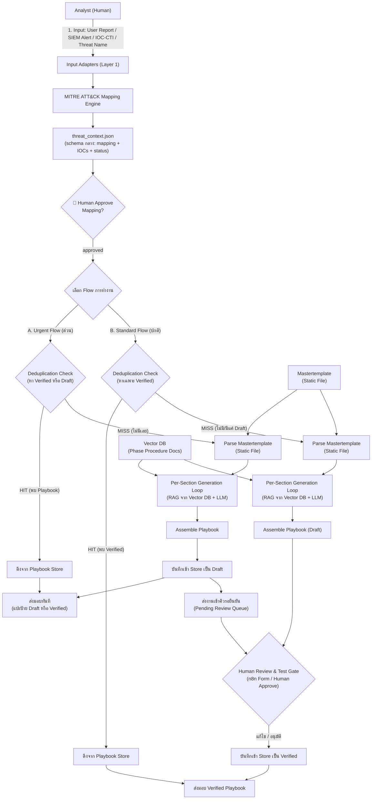
```mermaid
graph TD
    user["Analyst (Human)"] -- "1. Input: User Report / SIEM Alert / IOC-CTI / Threat Name" --> input["Input Adapters (Layer 1)"]
    input --> mapper["MITRE ATT&CK Mapping Engine"]
    mapper --> ctx["threat_context.json\n(schema กลาง: mapping + IOCs + status)"]
    ctx --> approve{"🧑 Human Approve\nMapping?"}
    approve -- "approved" --> flow_select{"เลือก Flow การทำงาน"}
    
    %% Urgent Flow (Fast Path)
    flow_select -- "A. Urgent Flow (ด่วน)" --> dedup_urg{"Deduplication Check\n(หา Verified หรือ Draft)"}
    dedup_urg -- "HIT (พบ Playbook)" --> store_fetch_urg["ดึงจาก Playbook Store"]
    store_fetch_urg --> output_urg["ส่งมอบทันที\n(แปะป้าย Draft หรือ Verified)"]
    
    dedup_urg -- "MISS (ไม่มีเลย)" --> parse_urg["Parse Mastertemplate\n(Static File)"]
    parse_urg --> loop_urg["Per-Section Generation Loop\n(RAG จาก Vector DB + LLM)"]
    loop_urg --> assemble_urg["Assemble Playbook"]
    assemble_urg --> save_draft["บันทึกเข้า Store เป็น Draft"]
    save_draft --> output_urg
    save_draft --> queue_rev["ส่งงานเข้าคิวรอยืนยัน\n(Pending Review Queue)"]

    %% Standard Flow (Verified Path)
    flow_select -- "B. Standard Flow (ปกติ)" --> dedup_std{"Deduplication Check\n(หาเฉพาะ Verified)"}
    dedup_std -- "HIT (พบ Verified)" --> store_fetch_std["ดึงจาก Playbook Store"]
    store_fetch_std --> output_std["ส่งมอบ Verified Playbook"]
    
    dedup_std -- "MISS (ไม่มี/มีแค่ Draft)" --> parse_std["Parse Mastertemplate\n(Static File)"]
    parse_std --> loop_std["Per-Section Generation Loop\n(RAG จาก Vector DB + LLM)"]
    loop_std --> assemble_std["Assemble Playbook (Draft)"]
    assemble_std --> review_gate{"Human Review & Test Gate\n(n8n Form / Human Approve)"}
    
    queue_rev --> review_gate
    
    review_gate -- "แก้ไข / อนุมัติ" --> save_verified["บันทึกเข้า Store เป็น Verified"]
    save_verified --> output_std
    
    vdb["Vector DB\n(Phase Procedure Docs)"] --> loop_urg
    vdb --> loop_std
    mastertemplate["Mastertemplate\n(Static File)"] --> parse_urg
    mastertemplate --> parse_std
```

---

## สถาปัตยกรรมแบบละเอียด (Detailed Architecture)

### Layer 1 — Input Layer (ชั้นรับข้อมูล)

ระบบรับ Input ได้ **3 ช่องทาง + 1 ทางสำรอง** — แต่ละช่องทางมีระดับความชัดเจน (confidence) ไม่เท่ากัน จึงใช้ **adapter คนละตัว** แล้วหลอมเข้า schema กลางตัวเดียวกัน (`threat_context.json`) แทนการหาอัลกอริทึมเดียวครอบทุกทาง:

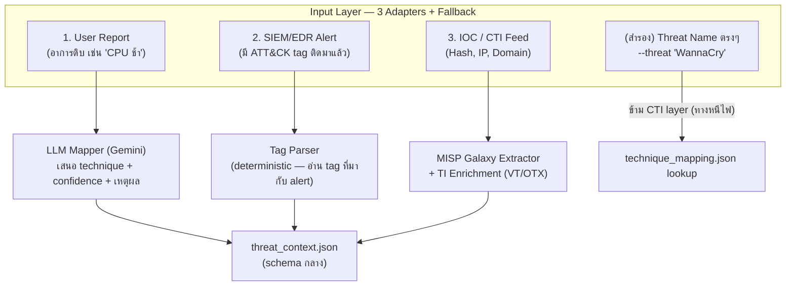
```mermaid
graph TD
    subgraph InputLayer ["Input Layer — 3 Adapters + Fallback"]
        rpt["1. User Report\n(อาการดิบ เช่น 'CPU ช้า')"]
        alert["2. SIEM/EDR Alert\n(มี ATT&CK tag ติดมาแล้ว)"]
        ioc["3. IOC / CTI Feed\n(Hash, IP, Domain)"]
        direct["(สำรอง) Threat Name ตรงๆ\n--threat 'WannaCry'"]
    end
    rpt --> ad1["LLM Mapper (Gemini)\nเสนอ technique + confidence + เหตุผล"]
    alert --> ad2["Tag Parser\n(deterministic — อ่าน tag ที่มากับ alert)"]
    ioc --> ad3["MISP Galaxy Extractor\n+ TI Enrichment (VT/OTX)"]
    ad1 --> ctx["threat_context.json\n(schema กลาง)"]
    ad2 --> ctx
    ad3 --> ctx
    direct -- "ข้าม CTI layer (ทางหนีไฟ)" --> map2["technique_mapping.json lookup"]
```

| ช่องทาง | ตัวแปลง → T-number | Confidence | Human Review |
|---|---|---|---|
| **User Report** (symptom) | LLM (Gemini) เสนอ technique พร้อมเหตุผล — แนวเดียวกับ MITRE TRAM | ต่ำ | **บังคับอนุมัติทุกรายการ** |
| **SIEM/EDR Alert** | parse ATT&CK tag ที่ติดมากับ alert (Sigma `attack.tXXXX`, Elastic `threat.technique.id`, Defender `MitreTechniques`) | สูง | ยืนยันเร็วได้ (tag มาจากระบบ detection) |
| **IOC / CTI** | MISP Galaxy tag / VirusTotal / AlienVault OTX enrichment | กลาง | galaxy = auto-approve, AI-เสริม = ต้องอนุมัติ |
| **Threat Name ตรง** | lookup ตารางมือ `technique_mapping.json` | สูง (คนเขียนเอง) | ผ่านได้เลย |

> [!NOTE]
> **เหตุผลที่คงทางสำรอง (Threat Name ตรง) ไว้:** เป็น "ทางหนีไฟ" ของโปรเจกต์ — ระบบ 2 ส่วน (CTI ingestion / Playbook generation) ต่อกันแบบหลวม ถ้า CTI layer มีปัญหาก่อนวันสอบ ฝั่ง generate ยังเดโมได้ครบวงจรด้วย input มือ เพราะทุกทางบรรจบที่ engine ตัวเดียวกัน

> [!WARNING]
> **ข้อควรระวังเรื่อง IOC Input:**
> อาการดิบๆ เช่น "CPU สูง" มัน ambiguous มาก อาจเป็น cryptomining (T1496), process injection (T1055)
> หรือ process ปกติก็ได้ — เป็นความสัมพันธ์ **many-to-many** ไม่ใช่ 1:1
> ทางที่ดี IOC ที่เข้าระบบควรเป็น detection ที่ผ่าน triage / มี ATT&CK tag มาแล้ว (จาก EDR/SIEM)
> ไม่ใช่ symptom ดิบที่ให้ระบบเดาเอง

---

### Layer 1.5 — CTI Ingestion & Normalization (✅ implement แล้วใน `poc/00_fetch_misp.py`)

ชั้นนี้ถูก implement จริงแล้ว (ก.ค. 2569) สำหรับช่องทาง CTI/MISP — เป็น stage ใหม่ที่วิ่ง **ก่อน** generator:

```
MISP event (live API / mock JSON)
   → Galaxy extractor  : ดึง technique_id จาก Galaxy cluster + Tag (mitre-attack-pattern)
   → AI mapper (Gemini) : เสนอ/เสริม technique; ถ้า Galaxy ว่าง → AI เสนอทั้งชุด
   → merge              : galaxy = approved อัตโนมัติ, ai-only = ต้องคนอนุมัติ
   → เขียน threat_context.json  (status = "pending")
   → 🧑 human review (interactive CLI: a/all/none/add/rm/ok/q)
   → อนุมัติ → AI enrichment เขียน description ละเอียดจาก technique + IOC ที่อนุมัติแล้ว
   → status = "approved" → ส่งต่อ generator (02_generate.py --context <file>)
```

**Schema กลาง `threat_context.json` (หัวใจของการ normalize):**

```jsonc
{
  "status": "pending" | "approved",   // gate หลัก — generator ปฏิเสธถ้ายังไม่ approved
  "threat_name": "...", "severity": "...", "description": "...",
  "source": { "type": "misp|mock|siem|user_report", ... },
  "mapping": [ { "technique_id": "T1486", "source": "galaxy|ai|manual",
                 "confidence": "high|medium|low", "reason": "...", "approved": true } ],
  "iocs": [ { "type", "value", "category" } ],
  "review": { "reviewed_by", "reviewed_at", "notes" }
}
```

เฉพาะ `mapping[].approved == true` เท่านั้นที่ถูกส่งเป็น `technique_ids` เข้า generator — adapter ของอีก 2 ช่องทาง (User Report / SIEM Alert) จะเขียน schema เดียวกันนี้ (ยังไม่ implement)

สำหรับ **User Report ที่กำกวม** (เช่น "CPU สูง") ใช้ LLM Enrichment ก่อน map:

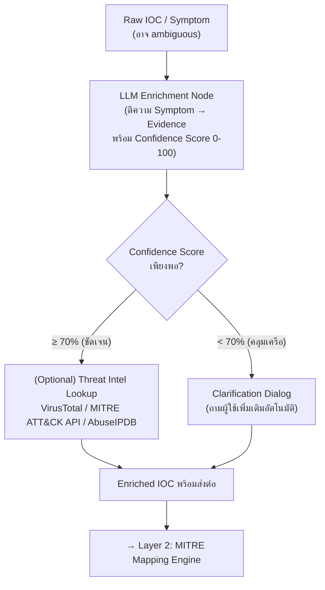
```mermaid
graph TD
    raw["Raw IOC / Symptom\n(อาจ ambiguous)"]

    raw --> enrich["LLM Enrichment Node\n(ตีความ Symptom → Evidence\nพร้อม Confidence Score 0-100)"]

    enrich --> conf{"Confidence Score\nเพียงพอ?"}

    conf -- "≥ 70% (ชัดเจน)" --> api_lookup["(Optional) Threat Intel Lookup\nVirusTotal / MITRE ATT&CK API / AbuseIPDB"]
    api_lookup --> ready["Enriched IOC พร้อมส่งต่อ"]

    conf -- "< 70% (คลุมเครือ)" --> clarify["Clarification Dialog\n(ถามผู้ใช้เพิ่มเติมอัตโนมัติ)"]
    clarify --> ready

    ready --> layer2["→ Layer 2: MITRE Mapping Engine"]
```

**กระบวนการ Enrichment ทีละขั้น:**

| ขั้นตอน | รายละเอียด |
|--------|----------|
| **1. LLM Enrichment** | LLM ตีความ Symptom ดิบให้เป็น Evidence ที่ชัดเจน เช่น `"CPU สูง + xmrig.exe"` → `"Cryptomining Activity detected"` |
| **2. Confidence Scoring** | ให้คะแนน 0–100 ว่า IOC ชัดเจนพอที่จะ Map ได้หรือยัง |
| **3a. High Confidence (≥70%)** | ส่งต่อไป Mapping ได้เลย อาจเพิ่ม Threat Intel API Lookup เพื่อยืนยันความแม่นยำ |
| **3b. Low Confidence (<70%)** | เปิด Clarification Dialog ถามผู้ใช้ว่าต้องการข้อมูลเพิ่มเติมอะไร |

**System Prompt ที่ใช้ใน LLM Enrichment Node:**

```
คุณคือ SOC Analyst ผู้เชี่ยวชาญ รับ IOC/Symptom ที่อาจคลุมเครือ แล้วทำการ:
1. วิเคราะห์ว่าเป็น False Positive หรือ True Positive
2. ระบุ Evidence ที่ชัดเจนที่สุดจาก Context ที่มี
3. ถ้าข้อมูลไม่พอ ระบุว่าต้องการข้อมูลเพิ่มเติมอะไร

Output เป็น JSON เท่านั้น:
{
  "classification": "suspicious|benign|insufficient_data",
  "enriched_ioc": "คำอธิบาย Evidence ที่ชัดเจน",
  "confidence": 0-100,
  "missing_context": ["คำถามที่ต้องถามผู้ใช้"]
}
```

**ตัวอย่าง Threat Intel API ที่ใช้เสริมได้ (Optional):**

| API | ข้อมูลที่ได้ | กรณีใช้งาน |
|-----|-----------|----------|
| **VirusTotal API** | ตรวจ IP/Hash/Domain ว่า Malicious หรือไม่ | Hash → `"Confirmed: XMRig Miner (Cryptominer)"` |
| **MITRE ATT&CK API** | ดึง Technique จากชื่อ Malware/Campaign โดยตรง | `"xmrig"` → T1496 |
| **AbuseIPDB** | ตรวจ IP ว่าถูก Report ทำอะไร | IP → `"Reported for C2 Communication"` |
| **OTX AlienVault** | Context ของ IOC จากชุมชนนักวิเคราะห์ | Hash → Related Techniques + Campaign |

> [!NOTE]
> ถ้า Input มี ATT&CK Tag ชัดเจนอยู่แล้ว (SIEM/EDR alert) ข้าม LLM Enrichment ได้เลย — Enrichment มีประโยชน์สูงสุดกับ Raw Symptom จากผู้ใช้ ซึ่งเป็นช่องทางเดียวที่ **บังคับ** ผ่าน human approve ทุกรายการ

---

### Layer 2 — Mapping Engine (ชั้นจับคู่ MITRE ATT&CK)

ระบบแปลง Input ให้เป็น **Technique ID** ของ MITRE ATT&CK Framework โดยอัตโนมัติ:

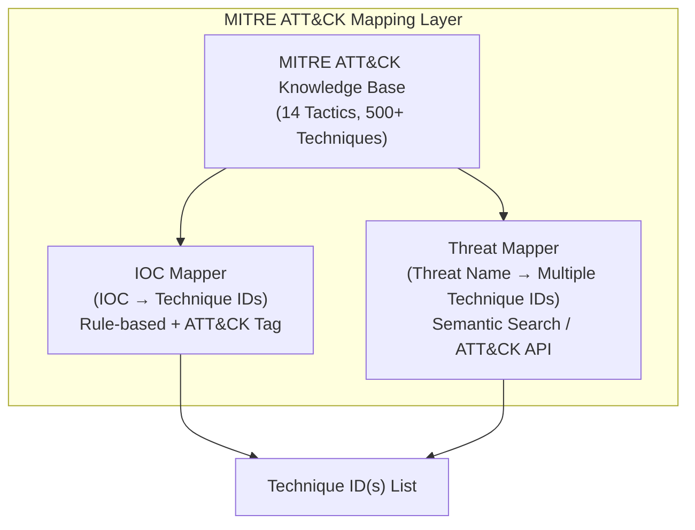
```mermaid
graph TD
    subgraph MappingLayer ["MITRE ATT&CK Mapping Layer"]
        kb["MITRE ATT&CK Knowledge Base\n(14 Tactics, 500+ Techniques)"]
        mapperA["IOC Mapper\n(IOC → Technique IDs)\nRule-based + ATT&CK Tag"]
        mapperB["Threat Mapper\n(Threat Name → Multiple Technique IDs)\nSemantic Search / ATT&CK API"]
    end
    kb --> mapperA
    kb --> mapperB
    mapperA --> result["Technique ID(s) List"]
    mapperB --> result
```

> [!NOTE]
> **ทั้งสองฝั่ง Map ได้หลาย Technique เหมือนกัน**
> IOC เดียวกันอาจเกี่ยวข้องกับหลาย Technique ได้ เช่น Phishing email อาจ map ได้ทั้ง T1566 และ T1204
> Threat เดียวกันยิ่ง map ได้หลาย Technique เช่น React2Shell → T1190, T1059, T1078, T1053, T1547
> Mapping ต้อง ground ด้วยแหล่งข้อมูลจริง (ATT&CK, CTI Feed) **ไม่ใช่ให้ LLM เดา**

**แหล่ง mapping ตามที่ implement/วางแผนจริง (ก.ค. 2569):**
- `galaxy` — จาก MISP Galaxy cluster/Tag (อนุมัติอัตโนมัติ เพราะมาจาก CTI ที่คน curate แล้ว) ✅ implement แล้ว
- `ai` — Gemini เสนอ พร้อม confidence + เหตุผล (**ต้องคนอนุมัติเสมอ**) ✅ implement แล้ว
- `manual` — ตาราง `technique_mapping.json` (ทางหนีไฟ) ✅ ใช้งานมาแต่แรก
- ทุก T-number ที่ AI เสนอควร validate กับข้อมูล MITRE จริงผ่าน **`mitreattack-python`** (official) หรือ ATT&CK STIX data (ใช้ offline ได้ — ปลอดภัยกว่าตอน demo) กันเลขที่แต่งขึ้นเอง — MITRE **Software objects** (เช่น WannaCry = `S0366`) ยังใช้ดึง technique ของมัลแวร์มีชื่อได้ตรงๆ ลดงาน mapping มือ (ยังไม่ implement)

---

### Layer 3 — Decision & Playbook Engine (ชั้นตัดสินใจและสร้าง Playbook)

หัวใจสำคัญของระบบ — ควบคุมลำดับการค้นหา การตรวจสอบความซ้ำซ้อนด้วยสถานะ และการใช้ **Per-Section Generation Loop**:

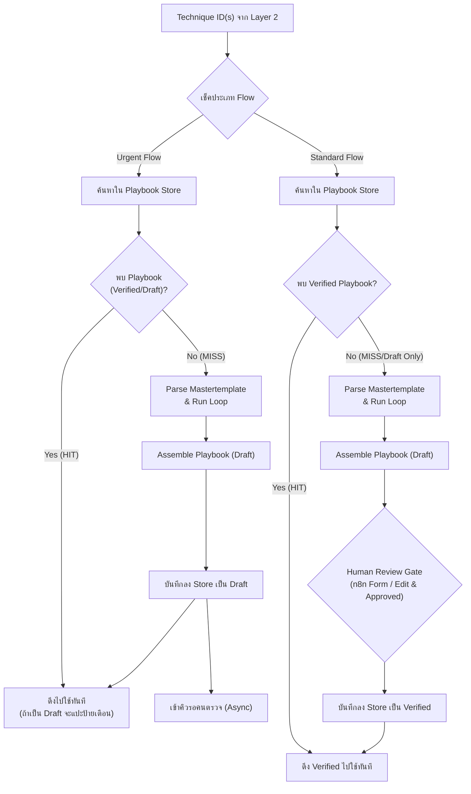
```mermaid
graph TD
    tid["Technique ID(s) จาก Layer 2"] --> flow_select{"เช็คประเภท Flow"}
    
    %% Urgent Flow Loop
    flow_select -- "Urgent Flow" --> query_store_urg["ค้นหาใน Playbook Store"]
    query_store_urg --> check_urg{"พบ Playbook\n(Verified/Draft)?"}
    check_urg -- "Yes (HIT)" --> deliver_urg["ดึงไปใช้ทันที\n(ถ้าเป็น Draft จะแปะป้ายเตือน)"]
    check_urg -- "No (MISS)" --> parse_urg["Parse Mastertemplate\n& Run Loop"]
    parse_urg --> assemble_urg["Assemble Playbook (Draft)"]
    assemble_urg --> save_store_urg["บันทึกลง Store เป็น Draft"]
    save_store_urg --> deliver_urg
    save_store_urg --> enqueue_review["เข้าคิวรอคนตรวจ (Async)"]

    %% Standard Flow Loop
    flow_select -- "Standard Flow" --> query_store_std["ค้นหาใน Playbook Store"]
    query_store_std --> check_std{"พบ Verified Playbook?"}
    check_std -- "Yes (HIT)" --> deliver_std["ดึง Verified ไปใช้ทันที"]
    check_std -- "No (MISS/Draft Only)" --> parse_std["Parse Mastertemplate\n& Run Loop"]
    parse_std --> assemble_std["Assemble Playbook (Draft)"]
    assemble_std --> review_gate{"Human Review Gate\n(n8n Form / Edit & Approved)"}
    review_gate --> save_store_std["บันทึกลง Store เป็น Verified"]
    save_store_std --> deliver_std
```

**กฎการตัดสินใจของ Deduplication Engine:**

- **Urgent Flow (เน้นความเร็วสูงสุด):**
  1. ค้นหา `Verified Playbook` ด้วย Technique ID ใน Store -> หากเจอให้ส่งมอบทันที
  2. หากไม่เจอ `Verified` แต่เจอ `Draft Playbook` -> ดึง `Draft` มาส่งมอบทันที โดยเพิ่มแบนเนอร์แจ้งเตือนเด่นชัด: `⚠️ [DRAFT - UNVERIFIED PLAYBOOK]` เพื่อแจ้งผู้ใช้ยอมรับความเสี่ยง
  3. หากไม่พบเลย -> สร้างใหม่เป็น `Draft` -> ส่งมอบ -> บันทึกเข้าระบบเป็น `Draft` -> ส่งงานเข้าคิวรอยืนยัน (Queue) เพื่อตรวจภายหลัง
- **Standard Flow (เน้นความปลอดภัยและถูกต้อง):**
  1. ค้นหา `Verified Playbook` ด้วย Technique ID ใน Store -> หากเจอให้ส่งมอบทันที
  2. หากไม่พบ หรือพบแค่ `Draft` -> เข้าสู่ขั้นตอน Generate ใหม่ -> ส่งมอบให้คนตรวจสอบแก้ไขผ่าน Portal (n8n Form) -> บันทึกผลลัพธ์เป็น `Verified` เสมอ

---

### Layer 3.5 — Mastertemplate Slot Architecture (โครงสร้าง Slot ของ Template)

Mastertemplate ไม่ใช่เอกสารให้คนอ่าน — มันคือ **spec ที่เครื่อง generator จะ parse**
แต่ละ section ประกอบด้วย 3 ส่วน:

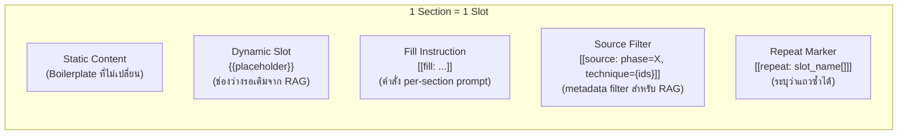
```mermaid
graph LR
    subgraph slot ["1 Section = 1 Slot"]
        static["Static Content\n(Boilerplate ที่ไม่เปลี่ยน)"]
        dynamic["Dynamic Slot\n{{placeholder}}\n(ช่องว่างรอเติมจาก RAG)"]
        fill["Fill Instruction\n[[fill: ...]]\n(คำสั่ง per-section prompt)"]
        source["Source Filter\n[[source: phase=X, technique={ids}]]\n(metadata filter สำหรับ RAG)"]
        repeat["Repeat Marker\n[[repeat: slot_name[]]]\n(ระบุว่าแถวซ้ำได้)"]
    end
```

**Convention ที่ใช้ใน Mastertemplate:**

| Marker | ความหมาย | ตัวอย่าง |
|--------|----------|----------|
| `{{placeholder}}` | ช่องว่าง dynamic ที่ generator จะเติม | `{{threat_name}}`, `{{containment_steps}}` |
| `[[fill: ...]]` | คำสั่ง prompt สำหรับ generate section นั้น | `[[fill: เขียน containment steps เป็น numbered list]]` |
| `[[source: ...]]` | metadata filter สำหรับ RAG retrieval | `[[source: phase=containment, technique={technique_ids}]]` |
| `[[repeat: ...]]` | ระบุว่า slot นี้ทำซ้ำได้หลายแถว | `[[repeat: mitre_techniques[]]]` |

**Slot Schema ทั้งหมดที่ Generator ต้อง Parse:**

```
Header:
  threat_name              : text
  detection_sla            : text
  mitre_techniques[]       : repeating (technique_id, tactic, technique_name)

Phase 1 — Preparation:
  prep_tools[]             : repeating rows (prep_tool, prep_check_command)
  [[fill: ใส่ tool ที่ต้องใช้ + คำสั่งเช็คความพร้อม]]
  [[source: phase=preparation, technique={technique_ids}]]

Phase 2 — Detection & Analysis:
  detection[]              : repeating rows (detection_item, detection_command)
  [[fill: list สิ่งที่ต้องตรวจ + คำสั่ง/query ต่อแถว]]
  [[source: phase=detection, technique={technique_ids}]]

Phase 3 — Containment:
  containment[]            : repeating rows (containment_target, containment_steps)
  [[fill: เขียน containment steps ที่ตรงกับ technique เป็น numbered list]]
  [[source: phase=containment, technique={technique_ids}]]

Phase 4 — Eradication & Recovery:
  eradication[]            : repeating rows (eradication_action, eradication_steps)
  [[fill: เขียนขั้นตอนกำจัด root cause + กู้คืนระบบ]]
  [[source: phase=eradication, technique={technique_ids}]]

Phase 5 — Post-Incident:
  post_incident_summary    : text
  [[fill: สรุป lessons learned + improvement actions]]
```

> [!CAUTION]
> **กฎเหล็กของ Mastertemplate:**
> - Template ต้องเป็น **threat-agnostic** — ห้ามมีชื่อ threat ใดๆ hardcode อยู่ในเนื้อหา
> - ใช้ `{{threat_name}}` แทน ไม่ใช่เขียนว่า "Phishing" ตรงๆ
> - ห้ามเอาเนื้อหา procedure จริงมายัดใน template — template มีแค่โครง + placeholder + instruction
> - ชื่อ placeholder ต้องเป็น **snake_case ตัวเล็กล้วน** ไม่มีเว้นวรรค

---

### Layer 4 — n8n Workflow Orchestration (ชั้นควบคุม Workflow)

n8n จะเป็นตัวแยกการทำงาน (Switch Node) และเก็บสถานะงานรอรีวิวด้วย Waiting Node:

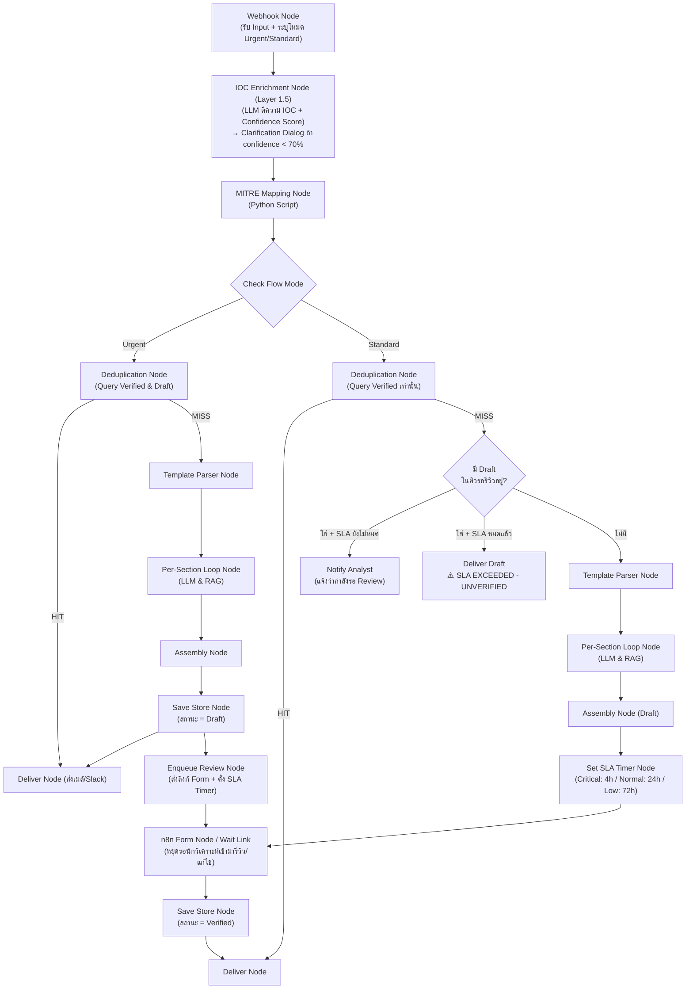
```mermaid
graph TD
    A["Webhook Node\n(รับ Input + ระบุโหมด Urgent/Standard)"]
    A_enrich["IOC Enrichment Node (Layer 1.5)\n(LLM ตีความ IOC + Confidence Score)\n→ Clarification Dialog ถ้า confidence < 70%"]
    B["MITRE Mapping Node\n(Python Script)"]
    C{"Check Flow Mode"}

    %% Urgent Path in n8n
    C -- "Urgent" --> D_urg["Deduplication Node\n(Query Verified & Draft)"]
    D_urg -- "HIT" --> H_urg["Deliver Node (ส่งเมล์/Slack)"]
    D_urg -- "MISS" --> E_urg["Template Parser Node"]
    E_urg --> F_urg["Per-Section Loop Node\n(LLM & RAG)"]
    F_urg --> G_urg["Assembly Node"]
    G_urg --> S_urg["Save Store Node\n(สถานะ = Draft)"]
    S_urg --> H_urg
    S_urg --> Q_urg["Enqueue Review Node\n(ส่งลิงก์ Form + ตั้ง SLA Timer)"]

    %% Standard Path in n8n
    C -- "Standard" --> D_std["Deduplication Node\n(Query Verified เท่านั้น)"]
    D_std -- "HIT" --> H_std["Deliver Node"]
    D_std -- "MISS" --> check_draft{"มี Draft\nในคิวรอรีวิวอยู่?"}
    check_draft -- "ใช่ + SLA ยังไม่หมด" --> notify_wait["Notify Analyst\n(แจ้งว่ากำลังรอ Review)"]
    check_draft -- "ใช่ + SLA หมดแล้ว" --> sla_fallback["Deliver Draft\n⚠️ SLA EXCEEDED - UNVERIFIED"]
    check_draft -- "ไม่มี" --> E_std["Template Parser Node"]
    E_std --> F_std["Per-Section Loop Node\n(LLM & RAG)"]
    F_std --> G_std["Assembly Node (Draft)"]
    G_std --> SLA_node["Set SLA Timer Node\n(Critical: 4h / Normal: 24h / Low: 72h)"]
    SLA_node --> W_std["n8n Form Node / Wait Link\n(หยุดรอนักวิเคราะห์เข้ามารีวิว/แก้ไข)"]
    W_std --> S_std["Save Store Node\n(สถานะ = Verified)"]
    S_std --> H_std

    Q_urg --> W_std
    A --> A_enrich --> B --> C
```

---

### Layer 5 — Data & Storage Layer (ชั้นจัดเก็บข้อมูล)

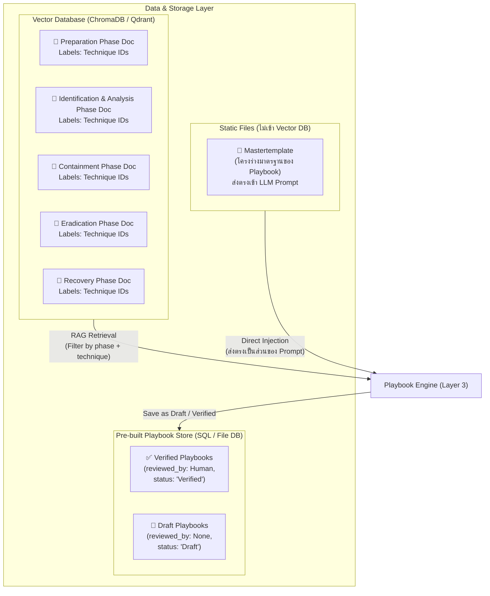
```mermaid
graph TD
    subgraph Storage ["Data & Storage Layer"]
        subgraph vdb ["Vector Database (ChromaDB / Qdrant)"]
            p1["📘 Preparation Phase Doc\nLabels: Technique IDs"]
            p2["📘 Identification & Analysis Phase Doc\nLabels: Technique IDs"]
            p3["📘 Containment Phase Doc\nLabels: Technique IDs"]
            p4["📘 Eradication Phase Doc\nLabels: Technique IDs"]
            p5["📘 Recovery Phase Doc\nLabels: Technique IDs"]
        end
        subgraph static ["Static Files (ไม่เข้า Vector DB)"]
            master["📄 Mastertemplate\n(โครงร่างมาตรฐานของ Playbook)\nส่งตรงเข้า LLM Prompt"]
        end
        subgraph store ["Pre-built Playbook Store (SQL / File DB)"]
            verified["✅ Verified Playbooks\n(reviewed_by: Human,\nstatus: 'Verified')"]
            drafts["📝 Draft Playbooks\n(reviewed_by: None,\nstatus: 'Draft')"]
        end
    end
    vdb -- "RAG Retrieval\n(Filter by phase + technique)" --> engine["Playbook Engine (Layer 3)"]
    static -- "Direct Injection\n(ส่งตรงเป็นส่วนของ Prompt)" --> engine
    engine -- "Save as Draft / Verified" --> store
```

**กลยุทธ์การจัดเก็บเอกสาร (Document Strategy — 6 Docs Total):**

| เอกสาร | จำนวน | ที่จัดเก็บ | เหตุผล |
|--------|--------|-----------|--------|
| **Mastertemplate** | 1 ไฟล์ | Static File (ส่งตรงใน LLM Prompt) | ป้องกัน Template "ระเบิด" จาก Chunking |
| **Phase Procedure Docs** | 5 ไฟล์ | Vector Database (with Technique Labels) | ค้นหาด้วย Semantic Search + Filter by Technique ID |

> [!IMPORTANT]
> **ทำไม Mastertemplate ต้องไม่เข้า Vector DB?**
> เพราะ Vector DB จะทำ Chunking (ตัดเอกสารเป็นท่อนเล็กๆ) ซึ่งจะทำลายโครงสร้าง Template
> ทำให้ Playbook ที่ Generate ออกมามีโครงสร้างไม่สมบูรณ์ (Template "ระเบิด")
> จึงต้องส่ง Mastertemplate เข้า LLM แบบตรงๆ ผ่าน System Prompt เพื่อรักษาโครงสร้างเอกสาร

**การเก็บสถานะใน Pre-built Playbook Store:**
- Playbook ทุกไฟล์ที่ถูกเก็บจะมี Metadata ประกอบด้วย:
  - `playbook_id`: รหัสเอกสาร (เช่น PB-1002)
  - `technique_id`: MITRE Technique ID
  - `status`: `Draft` หรือ `Verified` หรือ `Deprecated`
  - `created_at`: วันที่สร้าง
  - `verified_at`: วันที่ผ่านการตรวจสอบโดยคน (เว้นว่างหากสถานะเป็น Draft)
  - `verified_by`: ชื่อของนักวิเคราะห์ผู้รีวิว

**Chunking Strategy สำหรับ Phase Procedure Docs:**

| หัวข้อ | รายละเอียด |
|--------|-----------|
| **วิธี Chunk** | ตัดตาม heading/section ของเอกสาร (`## Phase:` / `### Sub:`) ไม่ใช่ fixed token — เก็บ list ขั้นตอนให้อยู่ก้อนเดียวกัน |
| **Metadata ต่อ Chunk** | `phase`, `technique_ids`, `technique_source` (`sub`/`playbook`), `threat_name`, `source_doc`, `sub_process` |
| **การ Filter** | ใช้ **metadata filter** (phase + technique) ร่วมกับ vector similarity — ไม่ใช่ similarity อย่างเดียว |
| **ทำไมต้อง Filter** | กันไม่ให้ chunk ของ Containment โผล่ตอนกำลังเขียน Preparation แค่เพราะใกล้กันเชิงความหมาย |

**การปรับ 3 อย่างจากผลทดลองจริง (ก.ค. 2569 — ✅ implement แล้วทั้งหมด):**

1. **Sub-technique Tagging** — แท็ก technique ที่ระดับ `### Sub:` (`technique_source: sub`) ไม่ใช่แค่ระดับทั้งเล่ม เพราะทดลองพบว่า technique ที่แชร์ log source เดียวกัน (เช่น Sysmon Event ID เดียวกัน) ข้าม threat ทำให้ chunk ปนกันหนัก
2. **Hybrid Knowledge Base** — KB มีเอกสาร 2 แบบผสมกัน: (ก) *threat-centric playbooks* (WannaCry, Phishing, ...) และ (ข) *technique-centric reference playbooks* (เล่มละ 1 technique เช่น `technique_T1486_...md`) สำหรับ technique ที่หลาย threat ใช้ร่วมกัน — ลดการเขียนเนื้อหาซ้ำซึ่งเป็นต้นเหตุของ retrieval collision
3. **Tiered Retrieval** — ผล retrieve ถูกจัดชั้นก่อนส่งเข้า LLM: `primary` (chunk ของ threat เอง / แท็กระดับ Sub) → `secondary` (เล่มอื่นที่ technique ตรง ใช้เสริม nuance) → `fallback` (phase อย่างเดียว **ติดธงชัดว่ายังไม่ยืนยัน technique**) พร้อมป้าย provenance (`threat=... | technique=...`) กำกับทุก chunk ให้ LLM แยกแกนหลักกับบริบทเสริมเองได้

> [!CAUTION]
> **หลัก Fail loudly, not silently:** ถ้า technique ไม่มีข้อมูลใน KB เลย ระบบต้องขึ้น `⚠️ Knowledge Coverage Warning` / Zero-Day banner — **ห้าม** fallback แบบเงียบไปดึง chunk ของ threat อื่นมาแทน (เคยเป็นบั๊กจริง: fallback แบบ phase-only ทำให้ป้ายเตือนไม่เคยขึ้นทั้งที่ KB ไม่มีข้อมูล) fallback tier ปัจจุบันจึงต้องติดธงเสมอ

**Technique Labels (Metadata) บน Phase Docs:**
- แต่ละ Phase Document จะมี Metadata ระบุ Technique IDs ที่เกี่ยวข้อง
- เมื่อ RAG Engine ค้นหา จะใช้ Technique ID จาก Layer 2 เป็นตัว Filter
- ช่วยลด Noise ได้มาก เพราะไม่ดึง Phase Docs ที่ไม่เกี่ยวข้องกับ Technique นั้นมาใส่ Context

---

## 🔄 Playbook Development Lifecycle (PDLC)

เพื่อแก้ไขปัญหา "สร้างเสร็จแล้วปล่อยลืม" (Generate & Forget) และรักษาความน่าเชื่อถือของเนื้อหาที่เป็นขั้นตอนปฏิบัติจริง ระบบจึงนำหลักการวงจรชีวิตของ Playbook มาบังคับใช้ โดยมีกระบวนการและสถานะการเปลี่ยนผ่านดังนี้:

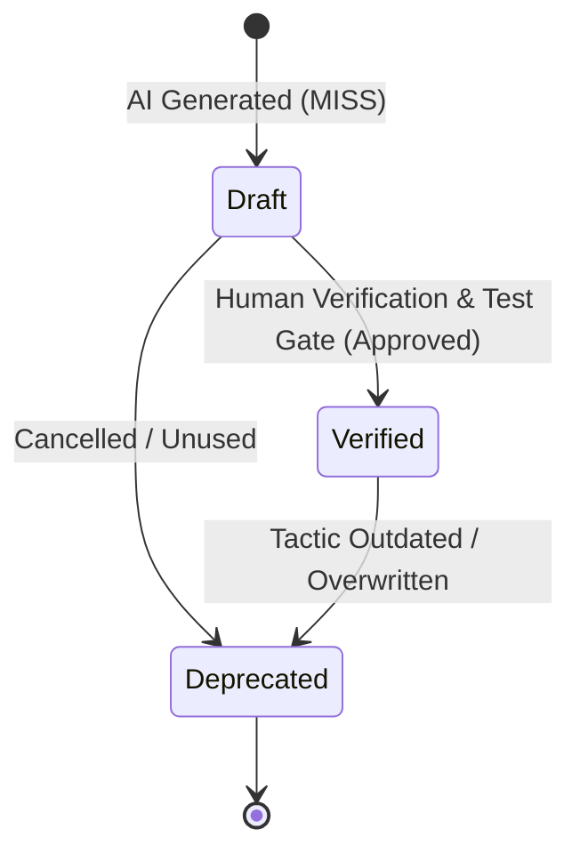
```mermaid
stateDiagram-v2
    [*] --> Draft : AI Generated (MISS)
    Draft --> Verified : Human Verification & Test Gate (Approved)
    Draft --> Deprecated : Cancelled / Unused
    Verified --> Deprecated : Tactic Outdated / Overwritten
    Deprecated --> [*]
```

### 1. สถานะเอกสาร (Playbook States)
- **Draft (ฉบับร่าง):** Playbook ที่พึ่งถูกสร้างขึ้นจาก AI ยังไม่ผ่านการตรวจสอบ/ทดสอบจริงโดยคน มีความเสี่ยงที่เนื้อหาบางอย่างอาจไม่ตรงกับระบบภายในขององค์กร หรืออาจมีหลอน (Hallucination) เล็กน้อย
- **Verified (ฉบับผ่านการตรวจสอบ):** Playbook ที่ได้รับการทดสอบและรับรองความถูกต้องโดยมนุษย์ (Security Analyst) เรียบร้อยแล้ว ถือว่าเป็นเอกสารที่น่าเชื่อถือ ใช้งานในระบบผลิตจริงได้อย่างปลอดภัย
- **Deprecated (ฉบับยกเลิกใช้งาน):** Playbook ที่หมดอายุหรือถูกแทนที่ด้วยวิธีรับมือที่ดีกว่า เพื่อไม่ให้คนหยิบไปใช้ซ้ำ

### 2. วงจรการพัฒนาระหว่าง 2 Flows
- **Urgent Flow (Fast Path):**
  - เน้นบริการผู้ใช้ทันทีเมื่อมีเคสระดับวิกฤตเกิดขึ้น
  - ผลลัพธ์ที่ส่งมอบให้ผู้ใช้จะถูกทำเครื่องหมายตัวใหญ่ชัดเจนว่าเป็น **Draft (Unverified)**
  - ในเบื้องหลัง ระบบจะส่งคำขอตรวจสอบเข้าคิว **Pending Review Queue** โดยอัตโนมัติเพื่อให้คนมารีวิวภายหลัง
- **Standard Flow (Verified Path):**
  - เป็นวงจรมาตรฐานในการสร้าง Playbook ต้นแบบเก็บสะสมไว้ใน Store
  - AI จะรัน RAG และ LLM เป็นด่านแรกเพื่อสร้างโครงร่าง
  - จากนั้นจะหยุดรอ (Wait) ที่ **Human Verification Gate** (ส่ง Form ไปให้นักวิเคราะห์แก้ไขและรีวิวผ่านเว็บฟอร์ม)
  - หลังจากคนคลิกตรวจสอบและกดยืนยัน (Approve) เท่านั้น เอกสารจึงจะได้รับการบันทึกเป็นสถานะ `Verified`

### 3. ⚠️ ปัญหา: Draft ค้างรอรีวิวใน Standard Flow — และวิธีแก้

**ปัญหา:** Standard Flow สร้าง Draft เสร็จและส่งให้ Reviewer ตรวจสอบ แต่ถ้า Reviewer ไม่ตอบสนองหรือยังไม่ Approve — ผู้ใช้รายใหม่ที่ร้องขอ Playbook เดิมใน Standard Flow จะถูกบล็อกรอต่อไปโดยไม่มีกำหนด

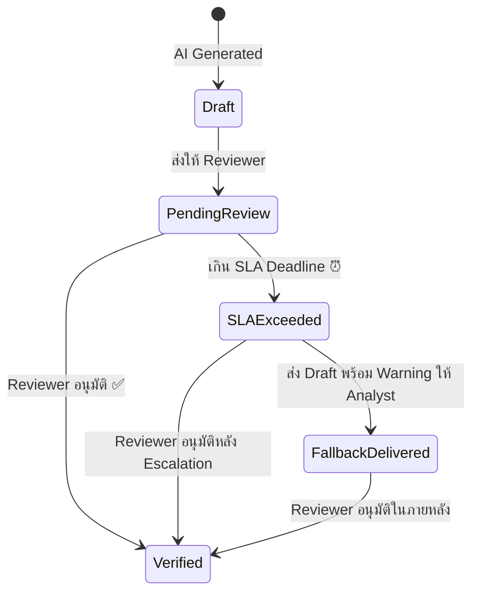
```mermaid
stateDiagram-v2
    [*] --> Draft : AI Generated
    Draft --> PendingReview : ส่งให้ Reviewer
    PendingReview --> Verified : Reviewer อนุมัติ ✅
    PendingReview --> SLAExceeded : เกิน SLA Deadline ⏰
    SLAExceeded --> Verified : Reviewer อนุมัติหลัง Escalation
    SLAExceeded --> FallbackDelivered : ส่ง Draft พร้อม Warning ให้ Analyst
    FallbackDelivered --> Verified : Reviewer อนุมัติในภายหลัง
```

**3 วิธีแก้ปัญหาที่ระบบรองรับ:**

| วิธี | กลไก | เมื่อไหร่ที่ทำงาน |
|-----|------|----------------|
| **SLA Timer + Escalation** | ตั้ง Deadline ต่อ Draft ตาม Severity → หมด SLA แจ้งเตือนซ้ำ → ยังไม่ตอบ → Escalate ไปหัวหน้า SOC | ทุก Draft ที่เข้าคิวรีวิว |
| **SLA Exceeded Fallback** | ถ้า SLA หมดและมีผู้ใช้ร้องขอ Playbook เดิมใน Standard Flow → ส่ง Draft พร้อมแบนเนอร์ `⚠️ SLA EXCEEDED - UNVERIFIED` แทนที่จะบล็อกรอต่อ | เมื่อรอเกิน SLA Deadline |
| **Priority Queue Bump** | ถ้ามีผู้ใช้ Request Playbook เดิมซ้ำขณะที่ Draft อยู่ในคิว → เพิ่ม Priority ของ Review Task ให้ Reviewer เห็นก่อน | เมื่อมี Request ซ้ำสำหรับ Draft ที่ค้างอยู่ |

**กฎ SLA ตามระดับความรุนแรงของภัยคุกคาม:**

| Severity | SLA สำหรับ Review | Escalation Target |
|---------|----------------|------------------|
| Critical / High | 4 ชั่วโมง | หัวหน้า SOC ทันที |
| Medium | 24 ชั่วโมง | หัวหน้า SOC + Lead Analyst |
| Low | 72 ชั่วโมง | Lead Analyst |

> [!NOTE]
> ใน n8n ใช้ **Schedule/Cron Trigger** + **Wait Node** + **HTTP Request Node** (ส่ง notification) เพื่อ implement SLA check อัตโนมัติได้โดยไม่ต้องเขียนโค้ดเพิ่มมาก

---

## Per-Section Generation Loop (กลไกการ Generate ทีละ Section)

นี่คือหัวใจของระบบ — ทำงานเป็น loop วนทีละ slot ตามโครงของ Mastertemplate:

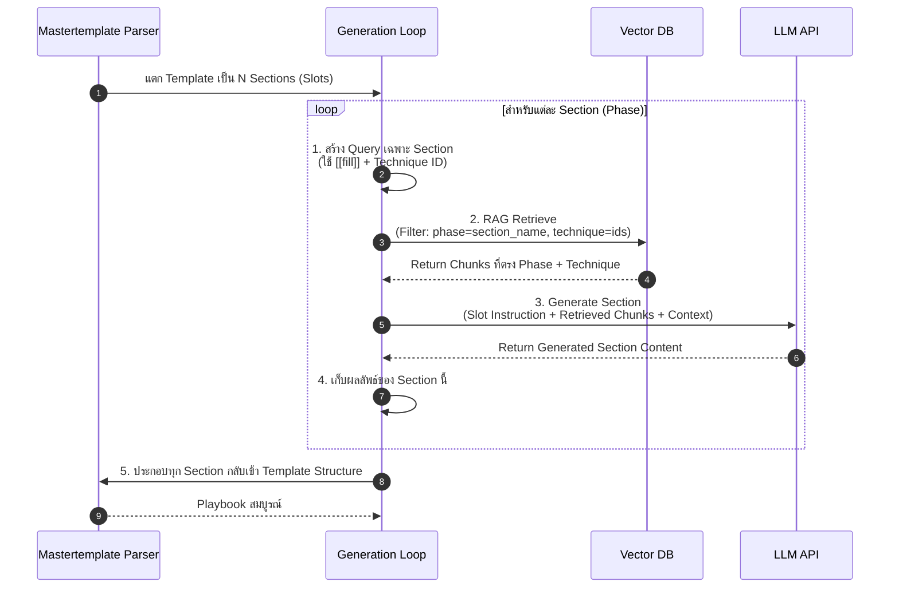
```mermaid
sequenceDiagram
    autonumber
    participant Template as Mastertemplate Parser
    participant GenLoop as Generation Loop
    participant VDB as Vector DB
    participant LLM as LLM API

    Template->>GenLoop: แตก Template เป็น N Sections (Slots)

    loop สำหรับแต่ละ Section (Phase)
        GenLoop->>GenLoop: 1. สร้าง Query เฉพาะ Section<br/>(ใช้ [[fill]] + Technique ID)
        GenLoop->>VDB: 2. RAG Retrieve<br/>(Filter: phase=section_name, technique=ids)
        VDB-->>GenLoop: Return Chunks ที่ตรง Phase + Technique
        GenLoop->>LLM: 3. Generate Section<br/>(Slot Instruction + Retrieved Chunks + Context)
        LLM-->>GenLoop: Return Generated Section Content
        GenLoop->>GenLoop: 4. เก็บผลลัพธ์ของ Section นี้
    end

    GenLoop->>Template: 5. ประกอบทุก Section กลับเข้า Template Structure
    Template-->>GenLoop: Playbook สมบูรณ์
```

**ตัวอย่าง 1 รอบของ Loop (Section: Containment):**

```
Query = "containment steps for T1190 / React2Shell"
      ↓
RAG Filter = { phase: "containment", technique_id: "T1190" }
      ↓
Retrieved Chunks:
  - "Isolate affected server from network immediately..."
  - "Block exploit traffic at WAF/reverse proxy..."
      ↓
LLM Prompt = [[fill]] instruction + Retrieved Chunks + Incident Context
      ↓
Generated Output = Containment section ที่เฉพาะกับ T1190
```

---

## Playbook Document Structure (โครงสร้างเอกสารที่ Generate)

โครงสร้างมาตรฐานของเอกสาร Playbook ที่สร้างขึ้นจาก Mastertemplate:

- **📋 Header Information**
  - Playbook ID (PB-XXXX)
  - `{{threat_name}}` / Technique ID(s)
  - MITRE ATT&CK Mapping `[[repeat: mitre_techniques[]]]`
  - Severity Level (ระดับความรุนแรง)
  - Generated At / Last Updated
- **1️⃣ Preparation Phase** `[[source: phase=preparation]]`
  - Prerequisites / Required Tools `[[repeat: prep_tools[]]]`
  - Team Roles & Responsibilities
  - Initial Checklist
- **2️⃣ Identification & Analysis Phase** `[[source: phase=detection]]`
  - Detection Indicators / IOC `[[repeat: detection[]]]`
  - Log Sources to Check
  - Analysis Steps (ทีละขั้น)
  - Severity Assessment Criteria
- **3️⃣ Containment Phase** `[[source: phase=containment]]`
  - Short-term Containment (ฉุกเฉิน) `[[repeat: containment[]]]`
  - Long-term Containment
  - Evidence Preservation Steps
- **4️⃣ Eradication & Recovery Phase** `[[source: phase=eradication]]`
  - Root Cause Removal Steps `[[repeat: eradication[]]]`
  - System Hardening Actions
  - Vulnerability Patching
  - System Restoration & Verification
- **5️⃣ Post-Incident Review**
  - Lessons Learned `{{post_incident_summary}}`
  - Improvement Actions

**Output เสริมที่วางแผนไว้ — TI Annotation 2 ระดับ (📋 แผน ยังไม่ implement):**
เมื่อ CTI feed เข้ามา ระบบจะ generate คำอธิบายภัยคุกคาม 2 ฉบับจาก context เดียวกัน (retrieve ครั้งเดียว, สั่ง LLM 2 รอบด้วย prompt คนละ audience):

| ฉบับ | กลุ่มเป้าหมาย | ลักษณะเนื้อหา |
|---|---|---|
| **ทางการ (Executive)** | ผู้บริหาร / คนทั่วไป | ภาษาอ่านง่าย ไม่มีศัพท์เทคนิค — ภัยคืออะไร กระทบอะไร ต้องทำอะไร |
| **เทคนิค (Technical)** | ทีม IT / SOC | T-number, IOC, log source, คำสั่งตรวจสอบ — ผูกกับ playbook ฉบับเต็ม |

---

## Tech Stack ที่เลือกใช้

| Component               | Technology                        | หน้าที่                                                | สถานะ |
|-------------------------|-----------------------------------|-------------------------------------------------------|-------|
| **Workflow Engine**     | n8n (Self-hosted)                 | ควบคุม Flow ทั้งหมด + Per-Section Loop               | 📋 แผน |
| **LLM**                | Gemini API (`gemini-flash-lite-latest`) | Generate Playbook + AI mapping + AI enrichment   | ✅ ใช้จริง |
| **Vector Database**     | ChromaDB (cosine similarity)      | เก็บ Embeddings ของ Procedures + Metadata Filter      | ✅ ใช้จริง |
| **Embedding Model**     | sentence-transformers `all-MiniLM-L6-v2` | แปลงเอกสารเป็น Vector — **รัน local ไม่พึ่ง API** | ✅ ใช้จริง |
| **CTI Source**          | MISP (PyMISP) + mock JSON offline | ดึง event + Galaxy ATT&CK tag เป็น input จริง         | ✅ ใช้จริง (mock ทดสอบแล้ว, live ยังไม่เคยยิง) |
| **MITRE ATT&CK Data**  | `mitreattack-python` / ATT&CK STIX (offline ได้) | validate T-number + ดึง technique ของ Software objects | 📋 แผน |
| **Mapping Script**      | Python (`00_fetch_misp.py`)       | Galaxy extractor + AI mapper + human review CLI       | ✅ ใช้จริง |
| **Deduplication Logic** | Python / n8n Function Node        | ตรวจสอบ Technique ID ก่อน Generate                   | 📋 แผน |
| **Template Parser**     | Python (`02_generate.py`)         | Parse Mastertemplate เป็น Slots + ประกอบกลับ           | ✅ ใช้จริง |
| **Document Format**     | Markdown (→ PDF ภายหลัง)          | รูปแบบ Output ของ Playbook                            | ✅ Markdown |
| **Playbook Store**      | SQLite / JSON Files / Google Drive| เก็บ Pre-built Playbook ที่ Auto-saved แล้ว           | 📋 แผน |
| **Frontend**            | Simple HTML Form / n8n Form Node  | UI สำหรับ Analyst ป้อน Input                         | 📋 แผน (ปัจจุบัน = CLI) |
| **DB Inspector**        | Streamlit (`04_inspect_db.py`)    | GUI เปิดดู chunk + ทดสอบ RAG query                    | ✅ ใช้จริง |

---

## Data Flow แบบ Step-by-Step (Urgent vs Standard Mode)

### A. Urgent Flow (Fast Path)

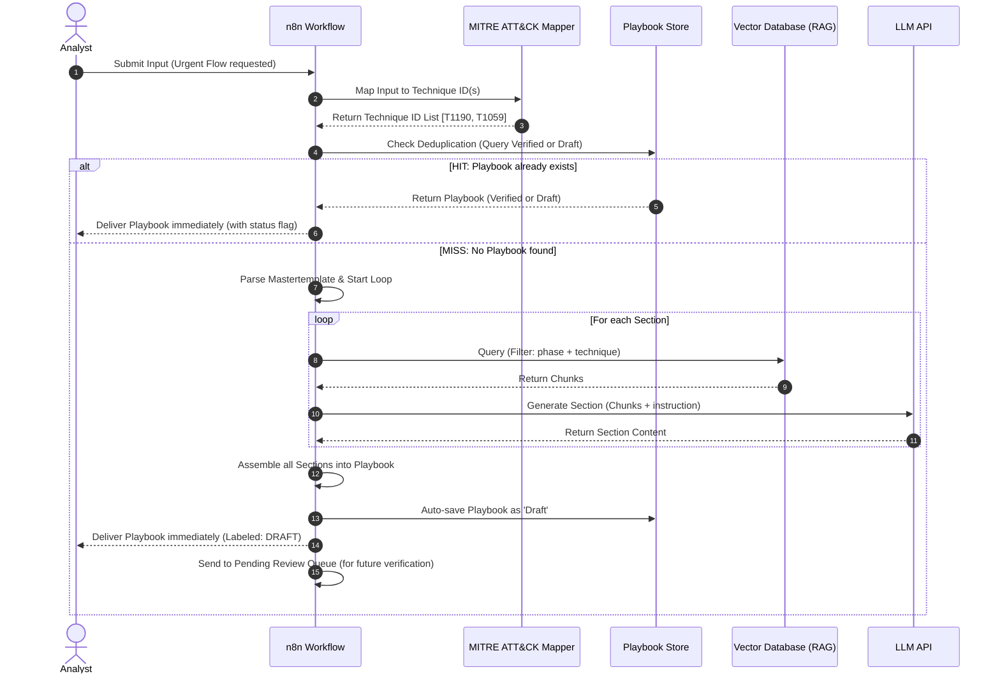
```mermaid
sequenceDiagram
    autonumber
    actor Analyst
    participant n8n as n8n Workflow
    participant MITRE as MITRE ATT&CK Mapper
    participant Store as Playbook Store
    participant VDB as Vector Database (RAG)
    participant LLM as LLM API

    Analyst->>n8n: Submit Input (Urgent Flow requested)
    n8n->>MITRE: Map Input to Technique ID(s)
    MITRE-->>n8n: Return Technique ID List [T1190, T1059]
    n8n->>Store: Check Deduplication (Query Verified or Draft)
    
    alt HIT: Playbook already exists
        Store-->>n8n: Return Playbook (Verified or Draft)
        n8n-->>Analyst: Deliver Playbook immediately (with status flag)
    else MISS: No Playbook found
        n8n->>n8n: Parse Mastertemplate & Start Loop
        loop For each Section
            n8n->>VDB: Query (Filter: phase + technique)
            VDB-->>n8n: Return Chunks
            n8n->>LLM: Generate Section (Chunks + instruction)
            LLM-->>n8n: Return Section Content
        end
        n8n->>n8n: Assemble all Sections into Playbook
        n8n->>Store: Auto-save Playbook as 'Draft'
        n8n-->>Analyst: Deliver Playbook immediately (Labeled: DRAFT)
        n8n->>n8n: Send to Pending Review Queue (for future verification)
    end
```

### B. Standard Flow (Human-Verified Path)

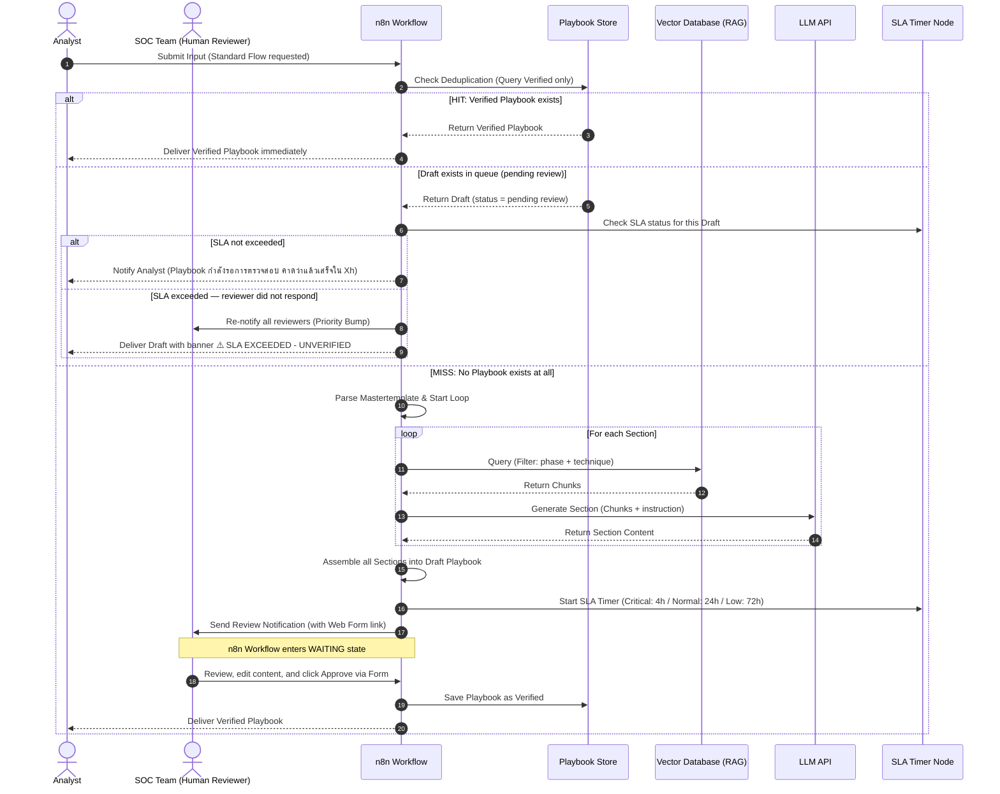
```mermaid
sequenceDiagram
    autonumber
    actor Analyst
    actor Reviewer as SOC Team (Human Reviewer)
    participant n8n as n8n Workflow
    participant Store as Playbook Store
    participant VDB as Vector Database (RAG)
    participant LLM as LLM API
    participant SLA as SLA Timer Node

    Analyst->>n8n: Submit Input (Standard Flow requested)
    n8n->>Store: Check Deduplication (Query Verified only)

    alt HIT: Verified Playbook exists
        Store-->>n8n: Return Verified Playbook
        n8n-->>Analyst: Deliver Verified Playbook immediately

    else Draft exists in queue (pending review)
        Store-->>n8n: Return Draft (status = pending review)
        n8n->>SLA: Check SLA status for this Draft
        alt SLA not exceeded
            n8n-->>Analyst: Notify Analyst (Playbook กำลังรอการตรวจสอบ คาดว่าแล้วเสร็จใน Xh)
        else SLA exceeded — reviewer did not respond
            n8n->>Reviewer: Re-notify all reviewers (Priority Bump)
            n8n-->>Analyst: Deliver Draft with banner ⚠️ SLA EXCEEDED - UNVERIFIED
        end

    else MISS: No Playbook exists at all
        n8n->>n8n: Parse Mastertemplate & Start Loop
        loop For each Section
            n8n->>VDB: Query (Filter: phase + technique)
            VDB-->>n8n: Return Chunks
            n8n->>LLM: Generate Section (Chunks + instruction)
            LLM-->>n8n: Return Section Content
        end
        n8n->>n8n: Assemble all Sections into Draft Playbook
        n8n->>SLA: Start SLA Timer (Critical: 4h / Normal: 24h / Low: 72h)
        n8n->>Reviewer: Send Review Notification (with Web Form link)
        Note over Reviewer, n8n: n8n Workflow enters WAITING state
        Reviewer->>n8n: Review, edit content, and click Approve via Form
        n8n->>Store: Save Playbook as Verified
        n8n-->>Analyst: Deliver Verified Playbook
    end
```

---

## กระบวนการ Self-Growing Store (การเติบโตของ Playbook Store)

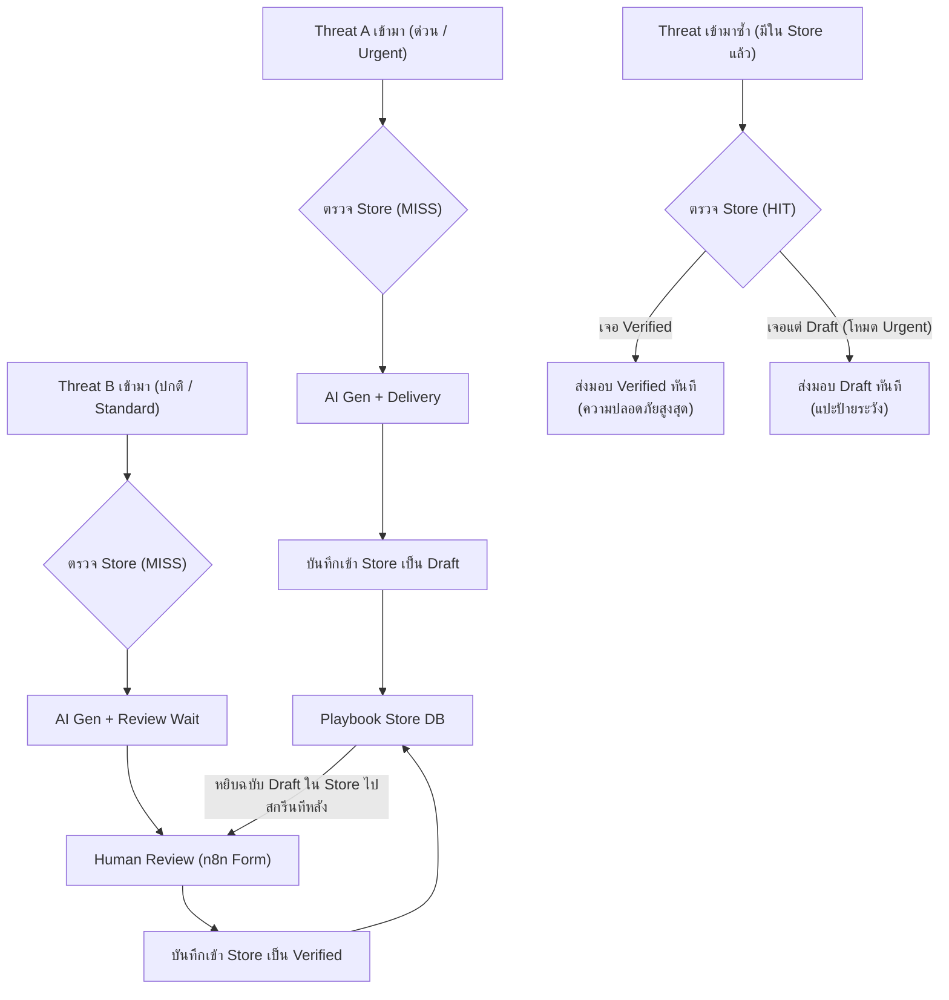
```mermaid
graph TD
    A["Threat A เข้ามา (ด่วน / Urgent)"] --> MISS_urg{"ตรวจ Store (MISS)"}
    MISS_urg --> Gen_urg["AI Gen + Delivery"]
    Gen_urg --> Save_Draft["บันทึกเข้า Store เป็น Draft"]
    
    Save_Draft --> StoreDB["Playbook Store DB"]
    
    B["Threat B เข้ามา (ปกติ / Standard)"] --> MISS_std{"ตรวจ Store (MISS)"}
    MISS_std --> Gen_std["AI Gen + Review Wait"]
    Gen_std --> Review_Gate["Human Review (n8n Form)"]
    Review_Gate --> Save_Ver["บันทึกเข้า Store เป็น Verified"]
    Save_Ver --> StoreDB
    
    %% Transition of Draft to Verified
    StoreDB -- "หยิบฉบับ Draft ใน Store ไปสกรีนทีหลัง" --> Review_Gate
    
    C["Threat เข้ามาซ้ำ (มีใน Store แล้ว)"] --> HIT{"ตรวจ Store (HIT)"}
    HIT -- "เจอ Verified" --> Deliver_Ver["ส่งมอบ Verified ทันที\n(ความปลอดภัยสูงสุด)"]
    HIT -- "เจอแต่ Draft (โหมด Urgent)" --> Deliver_Drf["ส่งมอบ Draft ทันที\n(แปะป้ายระวัง)"]
```

> [!TIP]
> **คุม Reproducibility และคุณภาพด้วย:**
> - ตั้ง LLM temperature ต่ำ (0.1–0.3) เพื่อความเสถียรของเนื้อหา
> - ใช้ Mastertemplate กำหนดกรอบของผลลัพธ์ไม่ให้หลุดขอบเขต
> - การนำระบบตรวจสอบคุณภาพโดยคนมาประยุกต์ใช้ (Human Review) จะทำให้ความถูกต้องของคลังความรู้สูงขึ้นอย่างเป็นระบบ

---

## ข้อควรระวังเชิงสถาปัตยกรรม (Architecture Considerations)

> [!WARNING]
> **Playbook ที่ Generate ออกมาอาจ "Generic" เกินไป**
> ถ้าเอกสาร Phase เป็นเนื้อหากลางๆ (preparation ทั่วไป) playbook ที่ได้ก็จะกลางๆ ตาม
> ของที่ทำให้ playbook มีค่าจริงคือ **detection + mitigation ที่เฉพาะกับ technique**
> ซึ่ง ATT&CK แต่ละ technique มี Detection + Mitigation ให้อยู่แล้ว ลองดึงมายัดตอน generate ด้วย

> [!WARNING]
> **Threat ใหม่ที่ยังไม่มีใคร Map**
> ATT&CK/CTI ของ CVE สดๆ อาจยังไม่มี mapping เป็นอาทิตย์
> ถ้าฝั่ง generate ไปพึ่ง LLM ล้วนๆ มันจะมั่ว
> Generate flow จะเชื่อถือได้เฉพาะ threat ที่ documented ดีแล้ว

---

## ขอบเขตที่อยู่ในระบบ / นอกระบบ

| ขอบเขต                                                          | ✅ ในระบบ | ❌ นอกระบบ |
|-----------------------------------------------------------------|----------|----------|
| รับ Input แบบ Text (User Report / IOC / Threat Name)            | ✅       |          |
| รับ CTI จาก MISP (event + Galaxy ATT&CK tag)                    | ✅       |          |
| รับ SIEM/EDR Alert แบบ export JSON (parse ATT&CK tag)           | ✅       |          |
| Map กับ MITRE ATT&CK อัตโนมัติ + Human approve mapping          | ✅       |          |
| RAG ดึง Context จาก Vector DB อัตโนมัติ (Filter by metadata)    | ✅       |          |
| Deduplication Check ก่อน Generate                              | ✅       |          |
| Per-Section Generation Loop (วน generate ทีละ section)         | ✅       |          |
| Auto-save Playbook ที่ไม่ซ้ำลง Pre-built Store                  | ✅       |          |
| Pre-built Store โตขึ้นเองทุกครั้งที่พบ Threat ใหม่              | ✅       |          |
| Output เป็น Markdown / PDF                                      | ✅       |          |
| TI Annotation 2 ระดับ (ฉบับทางการสำหรับคนทั่วไป + ฉบับเทคนิคสำหรับ IT) | ✅ (แผน) |     |
| เชื่อมต่อกับ SIEM โดยตรงแบบ Real-time (streaming feed)          |          | ❌       |
| Execute / Automate การแก้ไขระบบ (Remediation)                  |          | ❌       |
| Human Validation ก่อน Auto-save (ถ้าต้องการ Quality Control)   |          | ❌ (Optional) |

---

## Development Roadmap (ลำดับการพัฒนา)

| Step | งาน | เสร็จเมื่อ | สถานะ (8 ก.ค. 2569) |
|------|------|-----------|----------|
| **1** | ล็อค Mastertemplate + แตกเป็น Slot Structure | มี template ที่ threat-agnostic พร้อม slot markers | ✅ เสร็จแล้ว |
| **2** | เตรียม Test Case + เกณฑ์วัด | มี test retrieval ยืนยัน metadata filter | ✅ เสร็จแล้ว (`03_test_retrieval.py` 6/6) |
| **3** | Manual Fill Run (ไม่ใช้ Vector DB) | รู้ว่า prompt/template เวิร์คหรือต้องแก้ | ✅ ผ่านขั้นนี้มาแล้ว |
| **4** | สร้าง Retrieval Layer | retrieve ตรงกับที่คัดมือ | ✅ เสร็จ + อัพเกรดเป็น tiered retrieval |
| **5** | ประกอบ Generation Loop เต็ม | ใส่ threat name แล้ว generate ได้ครบทั้งเล่ม | ✅ เสร็จ (ทดสอบ end-to-end กับ WannaCry แล้ว) |
| **6** | Mapping Layer | input จริงแปลงเป็น technique list ได้ | ✅ manual table + MISP/AI mapper (adapter ฝั่ง User Report / SIEM Alert ยังไม่ทำ) |
| **7** | Human Review Gate | mapping ต้องผ่านคนอนุมัติก่อน generate | ✅ ฝั่ง mapping เสร็จ (`status=approved` gate) — ฝั่ง review ตัว playbook output + Store ยังไม่ทำ |
| **8** | Knowledge Base Curation | ทุกเล่มแท็ก sub-technique + คน review เนื้อหา | 🔄 บางส่วน (WannaCry เต็ม + technique-centric 8 เล่ม; อีก ~12 เล่มรอแท็ก) |
| **9** | n8n Orchestration + Playbook Store + PDLC | workflow อัตโนมัติเต็มรูป + Draft/Verified lifecycle | 📋 ยังไม่เริ่ม |
| **10** | TI Annotation 2 ระดับ + Scale | สรุปทางการ/เทคนิคจาก CTI + เพิ่ม threat | 📋 ยังไม่เริ่ม |

> [!TIP]
> **วินัยที่ต้องถือตลอดทาง:**
> - ทำ **1 template / 1 threat / manual ก่อน** เสมอ
> - ทำ **generate flow ก่อน retrieve flow** (เพราะ library ยังว่าง จะ retrieve อะไรไม่ได้)
> - Mapping ต้อง **ground ด้วย table** ก่อนค่อยพึ่ง LLM
> - คุม reproducibility ด้วย **temperature ต่ำ + cache ผลที่ผ่าน review**

---

## 📜 ประวัติการเปลี่ยนแปลงของสถาปัตยกรรม

| เมื่อไหร่ | เปลี่ยนอะไร | ทำไม / หลักฐาน |
|---|---|---|
| **มิ.ย. 2569** | ออกแบบ v1: Fully Automated, 2 Flow (Urgent/Standard), Playbook Store + PDLC, Mastertemplate slot, Per-Section Loop, metadata filter | จากการออกแบบร่วมกับที่ปรึกษา — เริ่มจาก PoC เล็กตามคำแนะนำอาจารย์ |
| **4 ก.ค. 2569** | หลัก **Fail loudly**: ตัด phase-only fallback, Coverage Warning / Zero-Day banner ต้องขึ้นจริง; เพิ่ม **sub-technique tagging**; แยก technique set ของ Brute Force ↔ RDP Brute Force | เจอบั๊กจริง (`include=["ids"]` + fallback เงียบ) ทำให้ filter ไม่เคยทำงานและป้ายเตือนไม่เคยขึ้น + ทดลองพบ chunk ปนข้าม threat (commit `65f03e0`) |
| **6 ก.ค. 2569** | แยกเอกสาร **poc-architecture.md** (ของจริงในโค้ด) ออกจาก architecture.md (vision) | กันสับสนระหว่างสิ่งที่ implement แล้วกับแผนอนาคต (commit `a7a89ef`) |
| **8 ก.ค. 2569** | **Hybrid KB**: เพิ่ม technique-centric reference playbooks 8 เล่ม + **Tiered Retrieval** (primary/secondary/fallback + provenance label) | แก้ root cause ของ retrieval collision — technique ที่หลาย threat แชร์กันถูกเขียนซ้ำหลายเล่ม (commit `ed0a700`) |
| **8 ก.ค. 2569** | **CTI/MISP Ingestion Layer** + schema กลาง `threat_context.json` + **Human approval gate** (`status=approved`) ก่อน generate เสมอ — จุดนี้เปลี่ยนปรัชญาจาก "Fully Automated" เป็น "Human-in-the-loop" | เปลี่ยน input จากชื่อ threat พิมพ์มือเป็น CTI จริง โดยห้าม auto-generate จาก mapping ที่คนยังไม่เช็ค (commit `0616568`) |
| **8 ก.ค. 2569** | ออกแบบ **3-Input Adapters** (User Report / SIEM Alert / IOC → schema กลาง), แผน validate T-number ด้วย `mitreattack-python`, แผน **TI Annotation 2 ระดับ** (ทางการ/เทคนิค) | ตอบโจทย์อาจารย์เรื่อง "ตัวแปลง input 3 แบบให้ map เป็น T-number ได้" — ยังเป็น design ยังไม่ลงมือ implement |

---

*จัดทำโดย: Omnissiah Project Team*  
*อัปเดตล่าสุด: 8 กรกฎาคม 2569*
